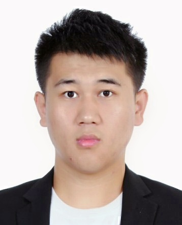

    <h1>李彤</h1>
    

        
            
            18515441211
        
        ·
        
            
            327578505@qq.com
        
        ·
        
            
            <a href="https://github.com/ezeli">Ezeli</a>
        
        ·
        
            
            <a href="https://ezeli.github.io/">My Blog</a>
        
    

##  个人信息

<table>
<tr>
<td width=80% style="border:none" align=left>
<ul style="margin:10px; padding:10px;">
  <li>
   24，1996 年出生
  </li>
  <li>
   求职意向：计算机视觉算法工程师
  </li>
  <li>
    个人主页:
    <a href="https://github.com/ezeli">https://ezeli.github.io/about</a>
  </li>
<ul>
</td>
<td width=20% style="border:none">
  
</td>
</tr>
</table>

##  教育经历

 - 本科，吉林大学，软件工程专业，2015.9 ~ 2019.7，成绩：年级前10%
 - 硕士，北京理工大学，计算机科学与技术专业，2019.9 ~ 2022.7
 - 通过了 CET4 英语等级考试

##  发表论文
 - aaa
 - bbb

##  获奖和竞赛情况

- xxx年，xx奖

##  实习经历

- **XXXX 公司，XXXX 部门，XXXX 工程师，2010.1~2010.9**

   负责 XXX
