## 1、原理

### 1）四种坐标系

为了将三维立体图形投影到平面上，应该首先理解以下四种坐标系：

本体坐标系（模型坐标系）：是为规定基本形体而引入的便于描述的坐标系，也就是立体图形自身的坐标系。

用户坐标系（世界坐标系）：是用户引入描述整个形体的坐标系。

观察坐标系（视坐标系或目坐标系）：为说明观察的姿态而引入，也就是观察者所处的位置。

设备坐标系（屏幕坐标系或显示坐标系）：最终的图形显示设备的坐标系。
<!-- more -->
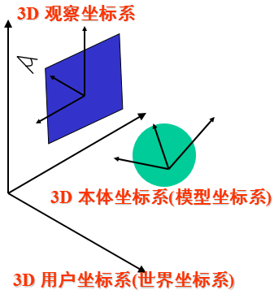

### 2）图形显示的坐标变换过程

为了方便计算三维立体图形的变化过程，程序中应该存储的是立体图形在模型坐标系下的坐标，所以为了将该立体图形投影到屏幕上，需要先将模型坐标系下的坐标转换为世界坐标系下的坐标，然后在转换为设备坐标。

设模型坐标系中任意一点P的坐标为P=(x, y, z)，做了三维图形几何变换后得到的点P'的坐标为P'=(x', y', z')，可得下面的三维图形几何变换：

（1）平移变换

x'= x + Dx；y'= y + Dy；z'= z + Dz。

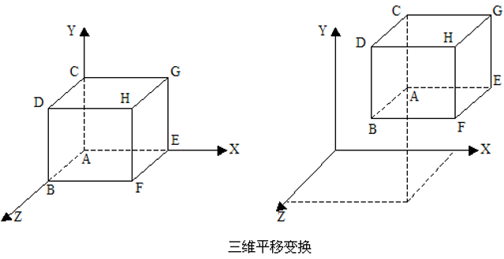

（2）比例变换

x' = x \* Sx；y' = y \* Sy；z' = z \* Sz。

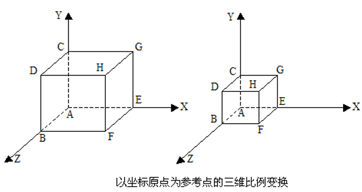

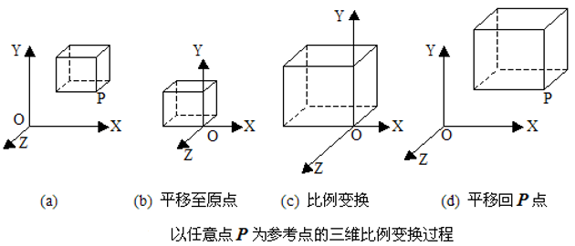

（3）旋转变换

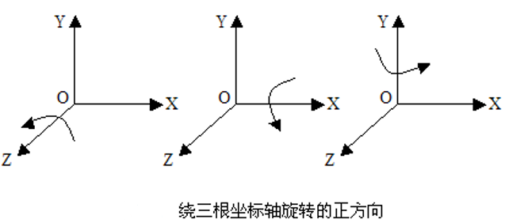

① 绕Z轴旋转

x' = xcosθ – ysinθ；  
y' = xsinθ + ycosθ；  
z' = z。

② 绕X轴旋转

x' = x；  
y' = ycosθ - zsinθ；  
z' = ysinθ + zcosθ。

③ 绕Y轴旋转

x' = xcosθ + zsinθ；  
y' = y；  
z' = -xsinθ + zcosθ。

### 3）透视投影

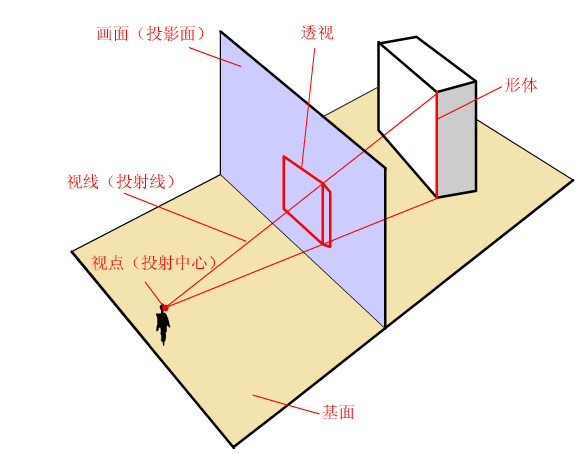

将三维立体坐标投影到屏幕上后再采用多边形的扫描转换算法进行填充。

主消失点：如果一组平行直线平行于三个坐标轴中的一个，那么对应的消失点将落在坐标轴上，这样的消失点称为主消失点。

因为只有三个坐标轴，所以最多只有三个主消失点。根据主消失点的数目，透视投影可以分为一点透视、二点透视、三点透视。

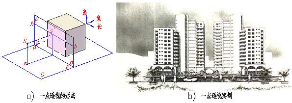

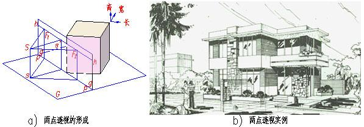

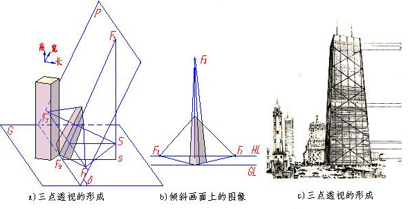

### 4）消除隐藏面

将三维立体图形投影到屏幕上时，首先应该判断面的可见性，若面不可见则无需投影。

设观察方向由指向观察位置的一个方向向量k给出，所考查的面的外法向量是n，则这两个向量的夹角α满足0≤α＜π/2时，所考查面是可见的，否则就是不可见的。

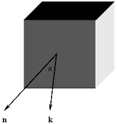

把n和k记作：n(nx, ny, nz)，k(kx, ky, kz)，则nx \* kx + ny \* ky + nz \* kz为正，则0≤α＜π/2，该面可见，否则不可见。

## 2、实践

### 1）题目要求

建立立方体的数据模型，将该立方体在视图中绘制出来，要求采用透视投影（选择显示效果较好的投影中心），并且能够通过按键实现三维图形绕x、y、z坐标轴的平移和旋转变换。

### 2）分析

（1）采用一点透视投影。首先确定四个坐标系的位置，以世界坐标系为主，将模型坐标系原点以及观察坐标系原点在世界坐标系中的位置确定下来，并且设备坐标系（即屏幕坐标）就是世界坐标系的z坐标值取0。

（2）初始化立方体八个顶点在模型坐标系中的坐标，在进行平移和旋转变换时，首先在模型坐标系中进行变换。

（3）在进行投影时，然后判断面的可见性，如果可见，将该面的四个顶点的坐标从模型坐标系转化为设备坐标系，然后构建边表。当立方体的六个面都判断后，通过多边形的扫描转换算法进行填充即可。

### 3）代码实现

（1）进行以下初始化：

```cpp
//定义面类
class Face
{
public:
	int m_v1;  //一个面四个顶点的索引
	int m_v2;
	int m_v3;
	int m_v4;
	COLORREF m_color;
public:
	Face();
	Face(int v1, int v2, int v3, int v4, COLORREF color);
	~Face();

	void setFace(int v1, int v2, int v3, int v4, COLORREF color);
};

//定义三维坐标类
class TDCoor
{
public:
	double x;
	double y;
	double z;
public:
	TDCoor();
	TDCoor(double x, double y, double z);
	~TDCoor();

	void setCoor(double x, double y, double z);
};

//在View类中定义以下成员
double m_cubeSide;  //立方体的边长
TDCoor m_modelInWorld;  //模型坐标系原点在世界坐标系中的坐标
TDCoor m_viewInWorld;  //观察坐标系原点在世界坐标系中的坐标
TDCoor m_cubeVertexes[8];  //立方体的八个顶点在模型坐标系中的坐标
double m_stepSize;  //位移步长
double m_rotationAngle;  //旋转角度
Face faces[6];

//初始化操作
m_cubeSide = 100;
m_modelInWorld.setCoor(400, 200, 100);
m_viewInWorld.setCoor(600, 50, -400);
m_stepSize = 1;
m_rotationAngle = 10;

faces[0].setFace(0, 1, 2, 3, RGB(255, 0, 0));
faces[1].setFace(4, 5, 6, 7, RGB(255, 97, 0));
faces[2].setFace(1, 2, 6, 5, RGB(0, 255, 0));
faces[3].setFace(0, 3, 7, 4, RGB(0, 0, 255));
faces[4].setFace(0, 1, 5, 4, RGB(255, 255, 0));
faces[5].setFace(3, 2, 6, 7, RGB(160, 32, 240));

double coorValue = m_cubeSide / 2;
m_cubeVertexes[0].setCoor(-coorValue, -coorValue, -coorValue);
m_cubeVertexes[1].setCoor(coorValue, -coorValue, -coorValue);
m_cubeVertexes[2].setCoor(coorValue, coorValue, -coorValue);
m_cubeVertexes[3].setCoor(-coorValue, coorValue, -coorValue);
m_cubeVertexes[4].setCoor(-coorValue, -coorValue, coorValue);
m_cubeVertexes[5].setCoor(coorValue, -coorValue, coorValue);
m_cubeVertexes[6].setCoor(coorValue, coorValue, coorValue);
m_cubeVertexes[7].setCoor(-coorValue, coorValue, coorValue);
```

（2）一组坐标转换方法：

```cpp
//方法定义：
void modelToWorld(TDCoor modelCoor, TDCoor &worldCoor);  //将模型坐标转换为世界坐标
void worldToModel(TDCoor worldCoor, TDCoor &modelCoor);  //将世界坐标转换为模型坐标
void modelToView(TDCoor modelCoor, TDCoor &viewCoor);  //将模型坐标转换为观察坐标
void viewToWorld(TDCoor viewCoor, TDCoor &worldCoor);  //将观察坐标转换为世界坐标
void worldToView(TDCoor worldCoor, TDCoor &viewCoor);  //将世界坐标转换为观察坐标
//将模型坐标转换为屏幕坐标，世界坐标的xy平面就是屏幕，screenCoor中的z永远认为是0
void modelToScreen(TDCoor modelCoor, TDCoor &screenCoor);

//方法实现：
void CCGWORK0908View::modelToWorld(TDCoor modelCoor, TDCoor & worldCoor)
{
	double x = modelCoor.x + m_modelInWorld.x;
	double y = modelCoor.y + m_modelInWorld.y;
	double z = modelCoor.z + m_modelInWorld.z;
	worldCoor.setCoor(x, y, z);
}

void CCGWORK0908View::worldToModel(TDCoor worldCoor, TDCoor & modelCoor)
{
	double x = worldCoor.x - m_modelInWorld.x;
	double y = worldCoor.y - m_modelInWorld.y;
	double z = worldCoor.z - m_modelInWorld.z;
	modelCoor.setCoor(x, y, z);
}

void CCGWORK0908View::modelToView(TDCoor modelCoor, TDCoor & viewCoor)
{
	modelToWorld(modelCoor, viewCoor);
	worldToView(viewCoor, viewCoor);
}

void CCGWORK0908View::viewToWorld(TDCoor viewCoor, TDCoor & worldCoor)
{
	double x = viewCoor.x + m_viewInWorld.x;
	double y = viewCoor.y + m_viewInWorld.y;
	double z = viewCoor.z + m_viewInWorld.z;
	worldCoor.setCoor(x, y, z);
}

void CCGWORK0908View::worldToView(TDCoor worldCoor, TDCoor & viewCoor)
{
	double x = worldCoor.x - m_viewInWorld.x;
	double y = worldCoor.y - m_viewInWorld.y;
	double z = worldCoor.z - m_viewInWorld.z;
	viewCoor.setCoor(x, y, z);
}

void CCGWORK0908View::modelToScreen(TDCoor modelCoor, TDCoor & screenCoor)
{
	TDCoor viewCoor;
	modelToView(modelCoor, viewCoor);
	double scale = -m_viewInWorld.z / viewCoor.z;
	double x = viewCoor.x * scale;
	double y = viewCoor.y * scale;
	viewCoor.setCoor(x, y, -m_viewInWorld.z);
	viewToWorld(viewCoor, viewCoor);
	screenCoor.setCoor(viewCoor.x, viewCoor.y, 0);
}
```

（3）坐标变换：

```cpp
//沿x轴平移
for (int i = 0; i < 8; i++)
{
	m_cubeVertexes[i].setCoor(m_cubeVertexes[i].x + m_stepSize, m_cubeVertexes[i].y, m_cubeVertexes[i].z);
}

//沿x轴旋转
double cosValue = cos(m_rotationAngle * M_PI / 180);
double sinValue = sin(m_rotationAngle * M_PI / 180);
for (int i = 0; i < 8; i++)
{
	double x = m_cubeVertexes[i].x;
	double y = m_cubeVertexes[i].y * cosValue - m_cubeVertexes[i].z * sinValue;
	double z = m_cubeVertexes[i].y * sinValue + m_cubeVertexes[i].z * cosValue;
	m_cubeVertexes[i].setCoor(x, y, z);
}
```

（4）实现OnDraw函数：

```cpp
TDCoor viewInModel;
worldToModel(m_viewInWorld, viewInModel);

//立方体中心坐标
double cubeCenterX = (m_cubeVertexes[0].x + m_cubeVertexes[6].x) / 2;
double cubeCenterY = (m_cubeVertexes[0].y + m_cubeVertexes[6].y) / 2;
double cubeCenterZ = (m_cubeVertexes[0].z + m_cubeVertexes[6].z) / 2;

//计算立方体中心到视点的向量
TDCoor viewVector(viewInModel.x - cubeCenterX, viewInModel.y - cubeCenterY, viewInModel.z - cubeCenterZ);
			
//判断立方体各个面是否可见
for (int i = 0; i < 6; i++)
{
	Face f = faces[i];
	TDCoor v1 = m_cubeVertexes[f.m_v1];
	TDCoor v2 = m_cubeVertexes[f.m_v2];
	TDCoor v3 = m_cubeVertexes[f.m_v3];
	TDCoor v4 = m_cubeVertexes[f.m_v4];

	//面中心坐标
	double faceCenterX = (v1.x + v3.x) / 2;
	double faceCenterY = (v1.y + v3.y) / 2;
	double faceCenterZ = (v1.z + v3.z) / 2;

	TDCoor normalVector(faceCenterX - cubeCenterX, faceCenterY - cubeCenterY, faceCenterZ - cubeCenterZ);

	//flag为正画面可见
	double flag = viewVector.x * normalVector.x + viewVector.y * normalVector.y + viewVector.z * normalVector.z;
	if (flag > 0)
	{
		TDCoor screenCoor[4];
		modelToScreen(v1, screenCoor[0]);
		modelToScreen(v2, screenCoor[1]);
		modelToScreen(v3, screenCoor[2]);
		modelToScreen(v4, screenCoor[3]);

		CPoint p[4];
		int j = 0;
		for (j = 0; j < 4; j++)
		{
			p[j].x = screenCoor[j].x;
			p[j].y = screenCoor[j].y;
		}

		//绘制四边形
		for (j = 0; j < 3; j++)
		{
			DDALine(&dcMem, p[j].x, p[j].y, p[j + 1].x, p[j + 1].y, RGB(0, 0, 0));
		}
		DDALine(&dcMem, p[3].x, p[3].y, p[0].x, p[0].y, RGB(0, 0, 0));

		//区域填充
		EdgeTable *et = TDBuildEdgeTables(p[0], p[1], p[2], p[3]);
		TDPolygonfill(&dcMem, et, f.m_color);
		delete et;
	}
}
```

### 4）实现效果

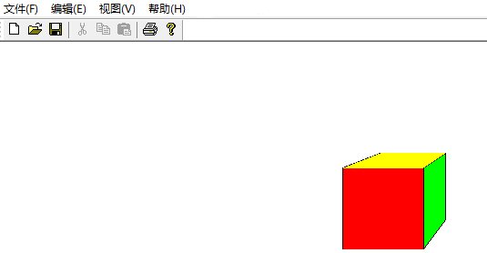

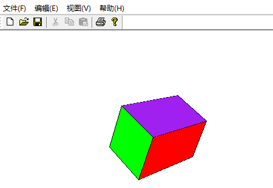
