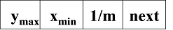
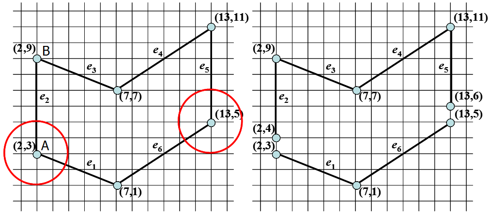
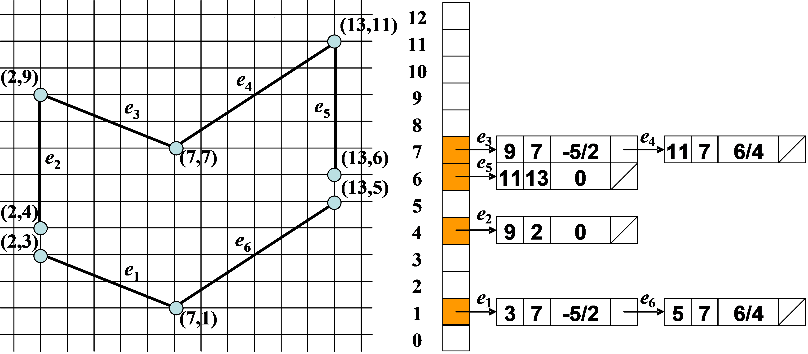
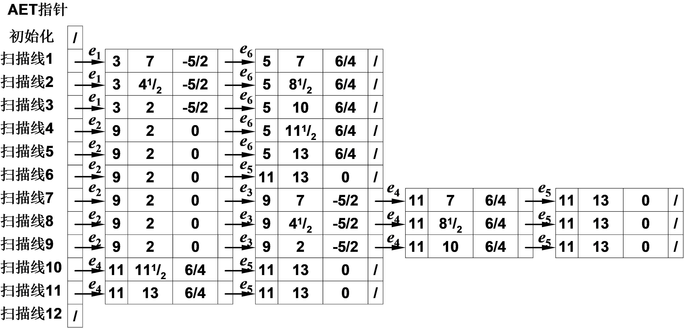
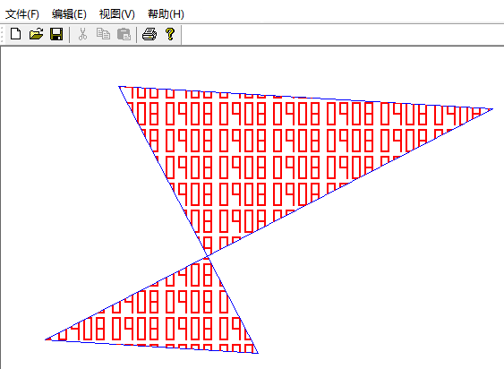

## 1、原理

### 1）区域的“奇偶”性质

多边形扫描转换主要依据区域的一种“奇偶”性质，即一条直线与任意封闭的曲线相交时，总是从第一个交点进入内部，再从第二个交点退出，在交替的进入退出过程中对多边形进行填充。
<!-- more -->
### 2）活跃边表（Active Edge Table，AET）

用这个表存贮与当前扫描线相交的各边。每次离开一条扫描线进入下一条之前，将表中有但与下一条扫描线不相交的边清除出表，将与下一条扫描线相交而表中没有的边加入表中。**AET中总是按x坐标递增排序**，因为在进行填充时，需要按该顺序判断是进入多边形内部还是从多边形内部出去。

### 3）边表（Edge Table，ET）

（1）在对多边形进行填充之前，首先应该建立多边形的边表来存储多边形的边的信息，边表是一种邻接表。**ET中各登记项按y坐标递增排序**，每一登记项下的“吊桶”按所记x坐标递增排序，“吊桶”中各项的内容依次是：

① 边的另—端点的较大的y坐标ymax。

② 与较小的y坐标对应的边的端点的x坐标xmin。

③ 斜率的倒数，即1/m。



（2）注意：在建立边表时，当顶点表现为是局部极大或局部极小时（下图中的B点），就看做是二个，否则看做一个。实际处理这个问题时，对局部极大或局部极小的顶点无需处理，而其它的顶点应该沿着边的方向缩进一个单位。

理由如下：例如在下图中，对于B点来来说，无需多做处理，因为当扫描线 y=9 时，e2和e3都会包含到AET中，也就是说B点在当前AET中会出现两次，当进行填充时，在该点会完成一次进入和退出，也就不会出现错误填充的情况。而对于A点来说，如果不进行缩进，当扫描线 y=3 时，e1和e2都会包含到AET中，所以A点同样在当前AET中出现两次，此时，AET中有三个点，y=3 这一行上A点之后的多边形内部区域并不会进行填充，发生错误，而且AET中应该永远包含偶数个点才对；进行缩进后，A点在当前AET中只出现一次，并且此时AET中有偶数个点，填充正确。



（3）建立好的ET如下所示：



### 4）扫描过程



### 5）填充算法的伪代码

```cpp
void Polygonfill(EdgeTable ET,  COLORREF color)
{
    1.y=边表ET中各登记项对应的y坐标中最小的值;
    2.活跃边表AET初始化为空表;
    3. while(ET表中仍有扫描线未被处理) //处理ET表中的每一条扫描线
    {
        3.1将ET中登记项y对应的各“吊桶”合并到表AET中，
        将AET中各吊桶按x坐标递增排序；
        3.2在扫描线y上,按照AET表提供的x坐标对，用color实施填充；
        3.3将AET表中有y=ymax的各项清除出表；
        3.4对AET中留下的各项,分别将x换为x+1/m.
        3.5由于前一步可能破坏了AET表中各项x坐标的递增次序，
        故按x坐标重新排序；//非简单多边形 
        3.6 y++，去处理下一条扫描线。
    }
}
```

## 2、实践

### 1）题目要求

通过鼠标输入顶点的方法绘制多边形，并实现多边形的扫描转换算法完成对该多边形的填充，要求使用“0908”数字图案对多边形内部进行填充，并且多边形边界为蓝色，填充颜色为红色。

### 2）分析

（1）定义一个30\*60的bool型数组m_pattern，用来存储需要填充的“0908”图案，在画像素点(x,
y) 时进行判断，如果m_pattern[y%30][x%60] 为true则进行填充，否则不进行填充。

（2）通过鼠标点击和移动绘制多边形的边，当多边形新绘制的点和第一个点的距离相差5个像素时，认为该多边形绘制完成。并且在绘制过程中完成边表的建立。对顶点进行处理时，取出当前点的前两个点，判断前一个点是否局部极大或局部极小，来决定是否要对前一个点进行缩进；并且在画最后一个顶点（也就是第一个顶点）时，既要判断前一个点是否要进行缩进，也要判断当前点是否要缩进。

（3）当最后一个点按下后，开始进行填充，开始时扫描线y值初始化为边表的第一个值（该值为多边形的最小的y值），之后扫描线逐步向上移动，然后按照边表更新活跃边表，并按区域的“奇偶”性质进行填充。

### 3）代码实现

（1）构建边表的部分代码：

```cpp
//如果条横边，不用加入边表
if (m_lastPoint.y != point.y)
{
//当顶点表现为是局部极大或局部极小时，就看做是二个，否则看做一个
if (((m_beforLastPoint.y <= m_lastPoint.y) && (point.y <= m_lastPoint.y)) ||
	((m_beforLastPoint.y >= m_lastPoint.y) && (point.y >= m_lastPoint.y)))
{
	//局部极大或局部极小时不作处理
	CPoint maxPoint = m_lastPoint.y > point.y ? m_lastPoint : point;
	CPoint minPoint = m_lastPoint.y > point.y ? point : m_lastPoint;

	pEdge edge = new Edge();
	edge->ymax = maxPoint.y;
	edge->xmin = minPoint.x;
	edge->next = NULL;
	edge->dx = (double)(maxPoint.x - minPoint.x) / (maxPoint.y - minPoint.y);

	//将边插入到正在绘制的多边形的边表中
	m_ETs.back()->insertEdge(minPoint.y, edge);
}
else
{
	//将m_lastPoint点缩进一个像素
	pEdge edge = new Edge();
	edge->dx = (double)(m_lastPoint.x - point.x) / (m_lastPoint.y - point.y);
	edge->next = NULL;

	if (m_lastPoint.y > point.y)
	{
		edge->ymax = m_lastPoint.y - 1;
		edge->xmin = point.x;

		//将边插入到正在绘制的多边形的边表中
		m_ETs.back()->insertEdge(point.y, edge);
	}
	else
	{
		edge->ymax = point.y;
		edge->xmin = m_lastPoint.x + edge->dx;

		//将边插入到正在绘制的多边形的边表中
		m_ETs.back()->insertEdge(m_lastPoint.y + 1, edge);
	}
}
```

（2）多边形的扫描转换算法实现：

```cpp
/*
	et是要绘制多边形的边表
	color是要填充的颜色
*/
void CTestView::Polygonfill(CDC * pDC, EdgeTable * et, COLORREF color)
{
	pDC->SetROP2(R2_COPYPEN);

	double y = et->vertexes.front()->ymin;    //扫描线
	double ymax = et->vertexes.back()->ymin;  //边表中的最大y坐标值

	if (m_AET)
	{
		delete m_AET;
		m_AET = NULL;
	}

	m_AET = new Vertex();
	m_AET->edge = NULL;

	pVertex tmp1 = NULL, tmp2 = NULL;
	pEdge tmp3 = NULL, tmp4 = NULL;
	while (m_AET->edge || y <=ymax)
	{
		//更新活跃边表
		tmp1 = m_AET;
		tmp2 = et->getVertex(y);
		m_AET = new Vertex();
		m_AET->edge = NULL;
		if (tmp1)
		{
			tmp3 = tmp1->edge;
			while (tmp3)
			{
				tmp4 = new Edge();
				tmp4->next = NULL;
				tmp4->dx = tmp3->dx;
				tmp4->xmin = tmp3->xmin;
				tmp4->ymax = tmp3->ymax;

				m_AET->insertEdge(tmp4);
				tmp3 = tmp3->next;
			}
		}
		if (tmp2)
		{
			tmp3 = tmp2->edge;
			while (tmp3)
			{
				tmp4 = new Edge();
				tmp4->next = NULL;
				tmp4->dx = tmp3->dx;
				tmp4->xmin = tmp3->xmin;
				tmp4->ymax = tmp3->ymax;

				m_AET->insertEdge(tmp4);
				tmp3 = tmp3->next;
			}
		}

		//tmp2是从边表中取出的所以不能delete
		if (tmp1)
		{
			delete tmp1;
			tmp1 = NULL;
		}

		//在扫描线y上,按照AET表提供的x坐标对，用color实施填充
		int yvalue = (int)y;
		int x1 = 0, x2 = 0;
		for (int i = 0; m_AET->getEdge(i); i += 2)
		{
			x1 = m_AET->getEdge(i)->xmin + 0.5 + 1;
			x2 = m_AET->getEdge(i + 1)->xmin + 0.5;
			for (; x1 < x2; x1++)
			{
				if (m_pattern[yvalue % 30][x1 % 60])
				{
					pDC->SetPixel(x1, yvalue, color);
				}
			}
		}

		//将AET表中有y=ymax的各项清除出表
		m_AET->removeEdge(y);
		//对AET中留下的各项,分别将xmin加上dx
		m_AET->addDx();
		//去处理下一条扫描线
		y++;
	}
}
```

### 4）实现效果


