> [论文链接](https://arxiv.org/abs/1811.10787) | [代码链接](https://github.com/fengyang0317/unsupervised_captioning)

## 一、主要思想
本文首先总结了以往的Image Caption的方法，将这些方法分成以下几类：
<!-- more -->
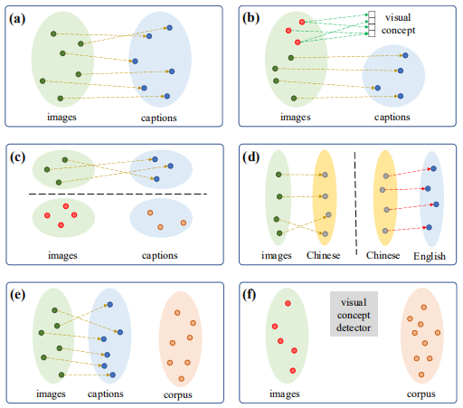

  - (a)是经典的caption方法，依赖于成对的图片--描述数据；
  - (b)除了配对数据，还引入了视觉概念信息，能够在生成的描述中加入一些新的对象（不存在与图片描述数据中，但是存在于图像识别数据集中）；
  - (c)主要解决了跨领域图片内容描述生成的问题，比如将MS COCO数据集作为源域（数据量较大），进行模型的预训练，使用Oxford-102和Flickr30k数据集作为目标域（数据量较小），对模型进行微调；
  - (d)使用一个中间语言（中文）作为枢纽，首先将生成图片的中间语言描述，然后在将中间语言翻译为目标语言（英文），这不再需要图像和目标语言字幕的配对数据；
  - (e)是一种半监督的方法，增加了一个外部语料库，比如做风格化描述有时候就会用到这种方法；
  - (f)是本文的无监督学习方式。

之前的方法都是监督学习或者半监督学习或者弱监督学习，依赖于成对的图像-句子数据集，但是这些数据集的获取非常昂贵，与Image Net和Open Images这些图像识别数据集相比，Microsoft COCO相对较小，并且数据集中的图像和句子种类限制在100个对象类别以内，因此，在这种配对的图像-句子数据上训练的模型很难推广到其他的图像上。在本文中，首次尝试以无人监督的方式训练图像描述模型，如(f)图所示：模型仅需要图像集，句子语料库和现有的视觉概念检测器。

鉴于现有的句子语料库主要是为语言研究而设计的，因此很少参考图像内容，所以本文在Shutterstock网站上抓取了200万个自然语句的大规模图像描述语料库，以方便无监督的图像字幕情景。（Shutterstock网站上提供了大量的图片和对应描述的信息）

本文受到了无监督神经机器翻译的启发，关键思想是通过具有跨语言嵌入的共享编码器将源语言和目标语言映射到公共空间，如下图所示，L1和L2两种语言使用一个共享的encoder，编码到同一个特征空间，然后分别使用不同的decoder进行还原。与之相比，无监督的图像字幕更具挑战性，图像和句子是两种形式的数据，具有显着不同的特征。卷积神经网络通常用作图像编码器，而递归神经网络适用于编码句子。由于它们的结构和特征不同，图像和句子的编码器很难像无人监督的机器翻译那样共享。

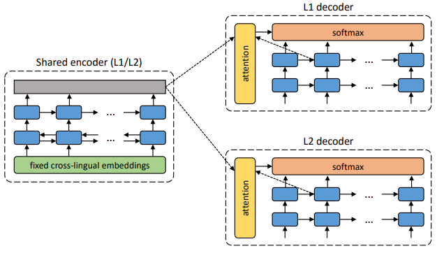

## 二、模型
本文的模型包括一个图片编码器（CNN），一个句子生成器（LSTM）和一个鉴别器（LSTM）：

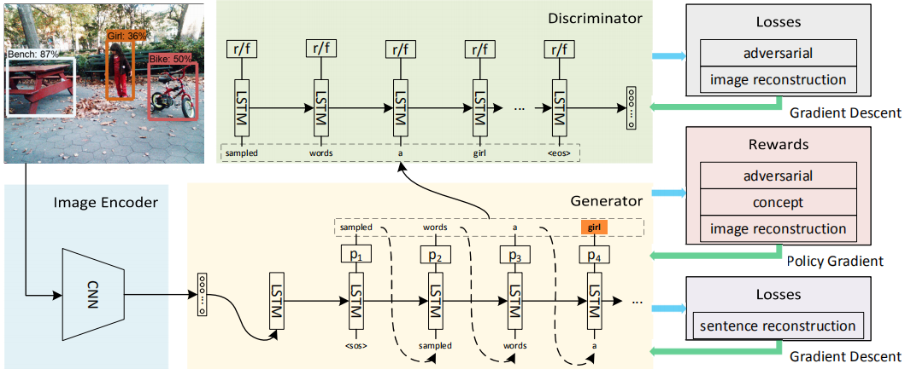

### 1、图片编码器
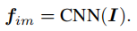

CNN可以选择常见的图片编码器，Inception-ResNet-v2、ResNet-50等都可以，本文选择了 Inception-V4。

### 2、句子生成器
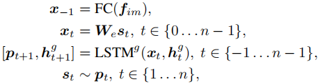

其中W是词嵌入矩阵，最后一步是采样操作，s是one-hot向量，p是字典中所有单词的概率。

### 3、鉴别器
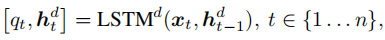

q_t表示模型已生成的部分句子(s_1, ..., s_t)被鉴别器认为是真实句子的概率，类似用q^_t真实句子的前t个单词被鉴别器认为是真实句子的概率。鉴别器的目的是区分部分句子是来自真实语料库还是由模型生成的。

### 4、训练目标
由于是无监督学习，无法提前知道图片描述，所以在训练时只能通过采样操作来获取前一步生成的单词，而采样操作是不可以误差反向传播的，所以本文采用Policy Gradient来优化模型参数。

#### 1）对抗训练
G和D在训练过程中，每一个时间步，都会给生成的单词一个对抗性奖励：

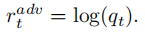

对于鉴别器，相应的对抗性损失定义为：

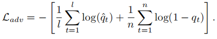

#### 2）视觉概念奖励
对抗性奖励仅鼓励模型根据语料库中句子的语法规则生成合理的句子，这可能与输入图像无关。为了生成相关的图像标题，模型必须学会识别图像中的视觉概念并将这些概念合并到生成的句子中。因此，需要将现有视觉概念检测器的知识提炼到图像字幕模型中。具体而言，当模型生成图片相应的视觉概念的单词时，我们对生成的单词给予奖励。这种奖励被称为概念奖励，其奖励值由该视觉概念的置信分数表示：

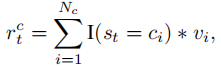

其中s_t表示第t步生成的单词，c_i表示图片对应的视觉概念单词，v_i表示对应的置信分数，N_c表示图片对应的视觉概念单词集合的数目。

#### 3）双向图像-描述重建
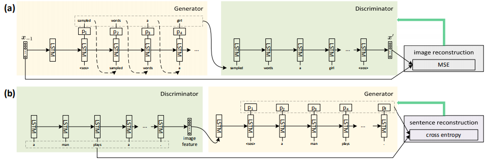

通过对抗训练和视觉概念奖励，描述质量将主要由视觉概念检测器决定，因为它是图像和句子之间的唯一桥梁。然而，现有的视觉概念检测器只能可靠地检测有限数量的对象概念。图像字幕模型应该理解图像更多的语义概念，以获得更好的泛化能力。为了实现这一目标，需要将图像和句子投影到一个共同的潜在空间，以便它们可以用来相互重建，这样，生成的标题将在语义上与图像一致。

**图片重建**

鉴别器最后使用一个全连接层将LSTM最后的隐藏状态投影到共同的潜在空间：

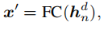

为训练鉴别器定义了额外的图片重建损失：

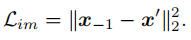

句子生成器的图片重建奖励定义为：

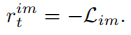

**句子重建**

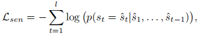

#### 4）整合
对于生成器，Policy Gradient训练方式根据联合奖励估计相对于可训练参数的梯度，联合奖励包括对抗奖励，概念奖励和图像重建奖励。除了由Policy Gradient估计的梯度之外，句子重建损失还通过反向传播为发生器提供梯度：

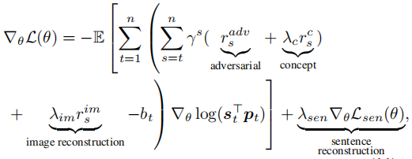

对于鉴别器：

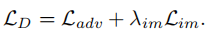

### 5、初始化
使用未标记数据从头开始训练模型具有挑战性，即使提出了三个目标也是如此，因此提出了一个初始化的方法来预先训练句子生成器和鉴别器。

关于生成器，先为每个训练图像生成伪描述，然后使用伪图像描述对来初始化模型。具体来说，首先构建一个由Open Images数据集中的对象类别组成的概念字典。其次，仅使用句子语料库来训练概念到句子（con2sen）模型：给定一个句子，把句子中包含在概念字典中的概念词全部提出来，将它们使用单层LSTM编码为特征表示，并使用另一个单层LSTM将表示解码为整个句子。第三，通过现有的视觉概念检测器检测每个图像的概念，利用检测到的概念和概念到句子模型，就能够为每个图像生成伪标题。第四，使用标准的监督学习方法训练具有伪图像标题对的生成器。这一过程命名为feature-tosentence（feat2sen）模型。

关于鉴别器，通过对抗训练来初始化参数。

## 三、性能比较
无监督字幕模型的表现可能看起来不令人满意，这主要是由于COCO的描述和爬取图像描述之间的语言特征不同。为了进一步证明所提出的三个目标的有效性，用训练图像的COCO描述替换爬取句子语料库，而其他设置与无监督模型保持一致，训练后得到了更好的结果。论文在实验中还加入了Ablation Studies（模型简化测试），具体实验结果请参看论文。
