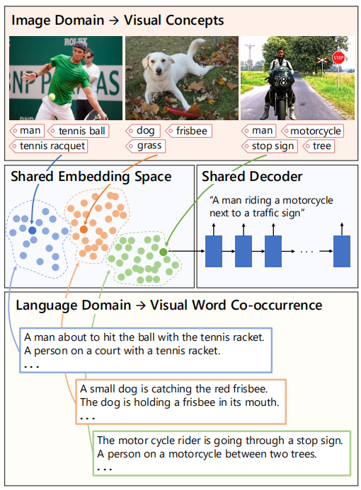
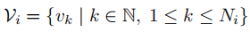
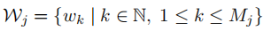
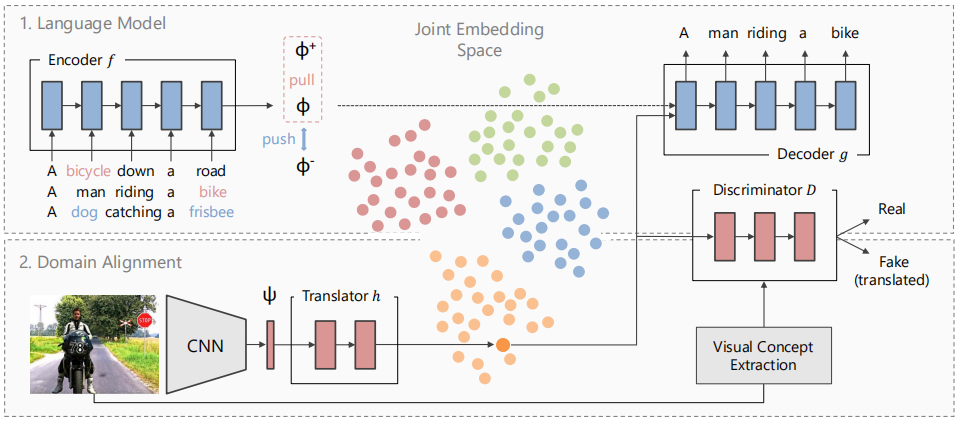
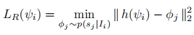
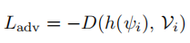

> [论文链接](https://arxiv.org/abs/1908.09317)

## 一、主要思想
文章首先提出了传统方法的问题：给图片标注描述信息很繁琐、昂贵，并且这些人工描述也都很短而且是重复的；当前的方法生成的描述受限于图片类别数和并不完美的验证指标，因此很难扩展到数据集以外的图片中。本文使用无监督的方式对独立的图像和文本进行建模，避免了带有人为偏见的而且昂贵的人工标注，当然，语料和图片并不是完全无关的，比如试图用经济学文本语料来描述图片是不合理的。
<!-- more -->
本文方法的概览图如下，主要是学习一个语言和图片特征的联合嵌入空间，这些特征由视觉概念及其共现组成。

## 二、模型
本文的方法有两个部分组成：一个语言模型和一个图像与文本域对齐模型。
符号介绍，第i个图片的视觉概念表示：

第j个句子的所有单词集合表示：

模型结构图如下：

### 语言模型
首先使用标准的seq2seq方法，通过训练文本语料库上的语言模型来学习无监督文本嵌入，也就是通过encoder将句子嵌入到潜在空间表示中，然后通过decoder将它还原成句子。除了这个训练方式，还需要在加上一项：两个包含公共单词（即文中的视觉概念单词，包含的公共单词数要大于2以减少对齐错误，因为比如“人”这个词经常在两个完全无关的句子中共同出现）的句子的表示间的距离应该大于不包含公共单词的两个句子的表示间的距离，这种方式在嵌入空间中加入了视觉感知结构。

### 图像与文本域联合
接下来，需要将图片特征嵌入到相同的潜在空间中，使它可以被解码器翻译成句子描述。
首先需要依赖图片和文本语料共有的视觉概念来进行初始化对齐工作：
构建一个图G(L，I，P)，图片I和句子P是图的节点，边P的权重表示它们之间的公共视觉概念的数目。
因为图片识别方法检测出的视觉概念的类别是有限的，所以在匹配句子的时候可以通过文本语料库中单词之间的相关关系（比如man和person）来扩充预测出的视觉概念数目。
初始化对齐使我们拥有了图片和文本之间的映射关系，但是这个映射是不精确的，因此可以通过这个映射关系和以下的规则来学习一个翻译函数h（可以是一个简单的多层感知器）来将图片特征更好地映射到潜在表示中：
**健壮的对齐损失**：

**对抗性训练**：
前面的对齐方式鼓励h更好的适应文本概念嵌入，然而，也需要确保这个映射不会丢失图像中重要的概念信息，所以使用条件鉴别器D进行对抗性训练。D训练时的正例是将翻译的特征h(ψi)与图像概念Vi的ont-hot编码的连接，负例是采样的配对文本的潜在表示φj与图像概念Vi的ont-hot编码的连接：

训练完成后，在推断阶段，首先将图片嵌入到公共潜在空间，之后通过共享的decoder即可得到对应的描述。