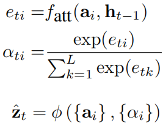
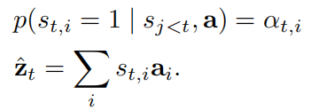
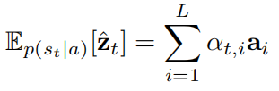
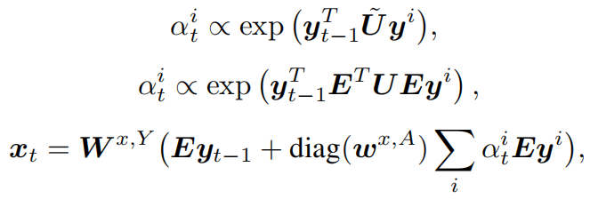

## 一、Show, Attend and Tell: Neural Image Caption Generation with Visual Attention, ICML2015

### 1、解决问题
之前大家一般使用CNN的最后一个隐藏层来提取图片特征，但是这个特征更多地关注于图片上最显著的物体，会丢失很多其他有用的信息，而这些信息可能会有助于RNN生成更丰富的描述，因此作者使用CNN低层提取出的特征集合来表示图片，这样可以保留更多的信息。并且我们人类观察图片时，不是将整个图片压缩成一个静态表示，而是通过注意力机制根据需要动态调节所观察的区域，因此作者通过模拟该机制使得模型在生成描述时可以动态关注图片的不同区域。
<!-- more -->

### 2、模型

模型结构如上图所示，其中注意力机制的流程为：通过LSTM上一个时间步输出的隐藏状态 $h_{t-1}$，计算出特征集合中每一个特征的权重，之后通过对特征进行加权求和得到上下文向量 $\hat{z}_t$，用于指导LSTM生成当前时间步的单词，公式如下：

作者提出两种特征加权求和的方式：“hard”注意力和“soft”注意力。对于“hard”注意力来说，加权求和的权重只能是1或者0，其中权重为1的概率就是计算出的权重的值：

对于“soft”注意力来说，就是根据计算出的权重对特征进行加权求和：

最终可视化结果如下图所示，上面是“soft”注意力机制，下面是“hard”注意力机制：

## 二、Image Captioning with Semantic Attention, CVPR2016

### 1、解决问题
之前的方法主要分为两种：自上而下和自下而上，其中自上而下的方法也就是基于编解码框架的深度学习的方式，将图像的特征转换为句子，它可以从训练数据中进行端到端的学习，而自下而上的方法是传统的基于模板的方法，首先提取出描述图像各个方面的单词然后使用语言模型将它们组合成语句。自上而下方法的一个局限是很难关注到在描述图像时可能很重要的精细细节，而自下而上的方法不会受到这个问题的影响，因为它可以在任何图像分辨率下自由操作，然而，该方法遇到了其他问题，例如不能进行端到端的训练。因此，作者提出了一个新的方法：通过语义注意模型将上述两种方法结合起来生成图片描述。

### 2、模型

如上图所示，首先提取出图片的特征表示和属性概念单词，之后在生成单词时，通过注意力机制动态决定每个属性单词参与的权重。模型框架如下图所示，其中注意力机制包括输入注意力模型和输出注意力模型，这是由于在单个句子的分析和合成过程中视觉概念可以以不同的顺序参与，因此在输入和输出时要计算两组不同的注意力权重。

输入注意力模型的计算过程如下：

输出注意力模型计算过程和输入注意力模型类似。
