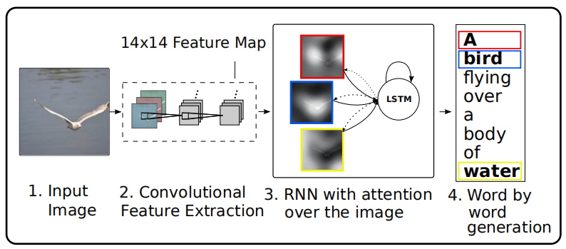
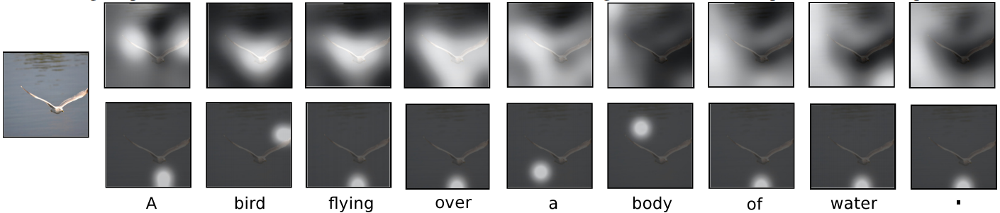
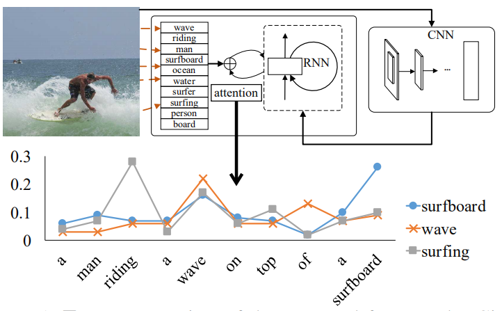
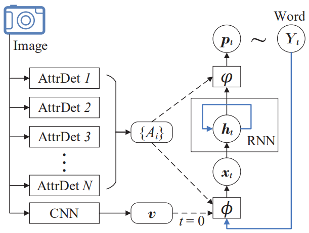

## 一、Show, Attend and Tell: Neural Image Caption Generation with Visual Attention, ICML2015

### 1、解决问题
我们人类观察图片时，不是将整个图片压缩成一个静态表示，而是通过注意力机制根据需要动态调节所观察的区域，当图像中存在大量杂乱时，这一点尤其重要。因此，作者参考人类的视觉系统，在编解码框架的基础上引入了注意力机制，使得模型在生成描述时可以动态关注图片的不同区域。
<!-- more -->

在之前的工作中大家使用CNN的最后一个隐藏层来提取图片特征，但是这个特征更多地关注于图片上最显著的物体，会丢失很多有用的信息，而这些信息可能会有助于RNN生成更丰富的描述。因此，如上图所示，作者使用CNN低层提取出的特征集合来表示图片，这样可以保留更多的信息，并且通过注意力机制来根据LSTM前一个时间步输出的隐藏状态动态调整这些特征，以引导模型关注对生成当前单词更重要的图片区域。

### 2、模型
LSTM解码器的公式表示如下：

$$
i_{t} = \sigma(W_{i}Ey_{t - 1} + U_{i}h_{t - 1} + Z_{i}{\hat{z}}_{t} + b_{i})
$$

$$
f_{t} = \sigma(W_{f}Ey_{t - 1} + U_{f}h_{t - 1} + Z_{f}{\hat{z}}_{t} + b_{f})
$$

$$
c_{t} = f_{t}c_{t - 1} + i_{t}\tanh{(W_{c}Ey_{t - 1} + U_{c}h_{t - 1} + Z_{c}{\hat{z}}_{t} + b_{c})}
$$

$$
o_{t} = \sigma(W_{o}Ey_{t - 1} + U_{o}h_{t - 1} + Z_{o}{\hat{z}}_{t} + b_{o})
$$

$$
h_{t} = o_{t}\tanh c_{t}
$$

其中，$y_{t-1}$是上一个生成的单词，$E$是词嵌入矩阵，${\hat{z}}_{t}$是上下文向量，它表示在时间步t时，经过注意力机制得到的图片输入的相关部分的动态表示，其计算过程为：

$$
e_{\text{ti}} = f_{\text{att}}(a_{i},h_{t - 1})
$$

$$
\alpha_{\text{ti}} = \frac{\exp{(e_{\text{ti}})}}{\sum_{k = 1}^{L}{\exp{(e_{\text{tk}})}}}
$$

$$
{\hat{z}}_{t} = \phi(\left\{ a_{i} \right\},\left\{ \alpha_{i} \right\})
$$

其中，$a_{i}$是提取出的第i个区域特征，$f_{\text{att}}$是注意力模型，用于根据LSTM上一个时间步的输出计算每个区域特征的权重，并且通过Softmax函数得到所有区域特征对应的注意力分数$\alpha$，$\phi$函数根据区域特征集合和求得的注意力分数集合得到上下文向量${\hat{z}}_{t}$。此外，作者采用如下方式初始化LSTM状态：

$$
c_{0} = f_{init,c}\left( \frac{1}{L}\sum_{i}^{L}a_{i} \right),\ h_{0} = f_{init,h}\left( \frac{1}{L}\sum_{i}^{L}a_{i} \right)
$$

其中$f_{init,c}$和$f_{init,h}$是两个独立的MLP网络。最后，输出的单词概率分布表示为：

$$
p(y_{t}|a,y_{1}^{t - 1}) \propto \exp{(L_{o}(Ey_{t - 1} + L_{h}h_{t} + L_{z}{\hat{z}}_{t}))}
$$

为了动态计算上下文向量${\hat{z}}_{t}$，作者提出两种$\phi$函数：

**1）随机的“硬”注意力**

此时，某个区域只存在完全被关注或者完全不被关注两种状态（1和0），其中被关注的概率由上述计算得到的注意力分数表示：

$$
p\left( s_{t,i} = 1 \middle| s_{j < t},a \right) = \alpha_{t,i}
$$

$$
{\hat{z}}_{t} = \sum_{}^{}{s_{t,i}a_{i}}
$$

作者定义了一个新的目标函数，它是边际对数似然函数$\log{p(y|a)}$的变分下界函数：

$$
L_{s} = \sum_{s}^{}{p\left( s \middle| a \right)\log{p\left( y \middle| s,a \right)}} \leq \log{\sum_{s}^{}{p\left( s \middle| a \right)p\left( y \middle| s,a \right)}} = \log{p(y|a)}
$$

它的梯度为：

$$
\frac{\partial L_{s}}{\partial W} = \sum_{s}^{}{p\left( s \middle| a \right)\left\lbrack \frac{\partial\log{p\left( y \middle| s,a \right)}}{\partial W} + \log{p\left( y \middle| s,a \right)\frac{\partial\log{p\left( s \middle| a \right)}}{\partial W}} \right\rbrack}
$$

之后，使用蒙特卡洛方法逼近该梯度：

$$
\frac{\partial L_{s}}{\partial W} \approx \frac{1}{N}\sum_{n = 1}^{N}\left\lbrack \frac{\partial\log{p\left( y \middle| {\tilde{s}}^{n},a \right)}}{\partial W} + \log{p\left( y \middle| {\tilde{s}}^{n},a \right)\frac{\partial\log{p\left( {\tilde{s}}^{n} \middle| a \right)}}{\partial W}} \right\rbrack
$$

其中${\tilde{s}}^{n}=(s_{1}^{n},s_{2}^{n},\ldots)$是采样得到的注意位置序列，而$s_{t}^{n}$是从Multinouilli分布采样获得：

$$
{\tilde{s}}_{t}^{n}\sim\text{Multinouilli}_{L}(\{\alpha_{i}^{n}\})
$$

并且采用滑动平均基线技术来减小方差，对第k个小批次数据，滑动平均基线计算如下：

$$
b_{k} = 0.9 \times b_{k - 1} + 0.1 \times \log{p(y|{\tilde{s}}_{k},a)}
$$

为了进一步减小评估方差，加入了Multinouilli分布的熵$H\lbrack s\rbrack$的梯度。

最后的学习规则为：

$$
\frac{\partial L_{s}}{\partial W} \approx \frac{1}{N}\sum_{n = 1}^{N}\left\lbrack \frac{\partial\log{p\left( y \middle| {\tilde{s}}^{n},a \right)}}{\partial W} + \lambda_{r}\left( \log{p\left( y \middle| {\tilde{s}}^{n},a \right)} - b \right)\frac{\partial\log{p({\tilde{s}}^{n}|a)}}{\partial W} + \lambda_{e}\frac{\partial H\lbrack{\tilde{s}}^{n}\rbrack}{\partial W} \right\rbrack
$$

其中，$\lambda_{r}$和$\lambda_{e}$是通过交叉验证设置的两个超参数。

为了进一步提高该学习规则的鲁棒性，对于一张给定图片，以0.5的概率将采样注意位置$\tilde{s}$设置为其期望值$\alpha$（等同于下面所讲的确定性注意）。

**2）确定性的“软”注意力**

此时，${\hat{z}}_{t}$由所有的区域特征加权求和计算，其权重就是上述计算得到的注意力分数：

$$
\mathbb{E}_{p(s_{t}|a)}\left\lbrack {\hat{z}}_{t} \right\rbrack = \sum_{i = 1}^{L}{\alpha_{t,i}a_{i}}
$$

该模型是平滑可导的，因此可以采用标准的反向传播进行端到端的训练。

在训练时，作者还引入了一种双随机正则项，鼓励模型对图片的每一部分给予同等的关注。由于在每个时间步，只需要保证$\sum_{i}^{}\alpha_{t,i}=1$即可，而没有其他的任何限制，这会导致解码器可能会忽略图片的一些部分。为了缓解这个问题，加入了一个新的限制：$\sum_{t}^{}\alpha_{t,i}\approx \tau,\ \tau \geq\frac{L}{D}$。另外，在每个时间步，软注意力模型还会根据之前的隐藏状态预测一个门控值$\beta$，也就是：$\phi\left(
\left\{ a_{i} \right\},\left\{ \alpha_{i} \right\} \right) =
\beta\sum_{i}^{L}{\alpha_{i}a_{i}},\ \beta_{t} = \sigma(f_{\beta}(h_{t -
1}))$,这个门控值让解码器在每个时间步决定更多地关注语言建模还是关注上下文信息。

所以，最终的目标函数为：

$$
L_{d} = - \log\left( p\left( y \middle| a \right) \right) + \lambda\sum_{i}^{L}{(1 - \sum_{i}^{C}\alpha_{\text{ti}})}^{2}
$$

下图表示在为同一张图片生成同一个描述时，“硬”注意力（下图）和“软”注意力（上图）两种机制的可视化结果。

## 二、Image Captioning with Semantic Attention, CVPR2016

### 1、解决问题
之前的图片文本描述方法主要分为两种：自上而下和自下而上，其中自上而下的方法也就是基于编解码框架的深度学习的方式，首先将图片编码成特征向量，然后将它解码为文本描述，这可以从训练数据中进行端到端的学习，而自下而上的方法是传统的基于模板的方法，首先提取出描述图片各个方面的单词然后使用语言模型将它们组合成语句。自上而下方法的一个局限是很难关注到在描述图像时可能很重要的精细细节，而自下而上的方法不会受到这个问题的影响，因为它可以在任何图像分辨率下自由操作，然而，该方法遇到了其他问题，例如不能进行端到端的训练。因此，作者提出了语义注意力模型，能够将上述两种方法结合起来生成图片描述。

### 2、模型

如上图所示，作者首先使用CNN提取出图片的视觉特征，同时检测出图片的视觉概念词（区域、物体、属性等），之后使用语义注意力模型将这些概念词动态组合到一起，用于指导RNN生成描述。下方的折线图展示了在生成描述的过程中，几个候选概念词的注意力权重的变化。

上图为语义注意力模型的详细结构图，其工作流程表示为：

$$
x_{0} = \phi_{0}\left( v \right) = W^{x,v}v
$$

$$
h_{t} = RNN(h_{t - 1},x_{t})
$$

$$
Y_{t}\sim p_{t} = \varphi(h_{t},\left\{ A_{i} \right\})
$$

$$
x_{t} = \phi\left( Y_{t - 1},\left\{ A_{i} \right\} \right),\ t > 0
$$

其中$v$表示提取出的图片特征，经过线性映射后作为RNN第一个时间步的输入，$\left\{
A_{i} \right\}$表示检测出的图片视觉概念词集合，而$\phi$和$\varphi$分别表示输入和输出注意力模型，用于动态决定每个概念词参与当前单词生成时所占的权重。之所以使用两个注意力模型，是由于在单个句子的分析（即输入）和合成（即输出）过程中，视觉概念词可以以不同的顺序进行参与，因此会计算出两组不同的注意力权重。

**1）输入注意力模型**

首先计算出每个概念词的注意力权重：

$$
\alpha_{t}^{i} \propto \exp{(y_{t - 1}^{T}E^{T}\text{UE}y^{i})}
$$

其中$E$表示词嵌入矩阵，$U$是一个可学习的矩阵，$y_{t-1}$是上一步预测的单词，$y^{i}$是视觉概念词，它们都表示为one-hot向量。之后，可以计算出当前时间步的输入：

$$
x_{t} = W^{x,Y}(Ey_{t - 1} + diag(w^{x,A})\sum_{i}^{}{\alpha_{t}^{i}Ey^{i}})
$$

其中$diag(w^{x,A})$表示由向量$w^{x,A}$构造的对角矩阵，而$w^{x,A}$建模了在单词空间的每个维度中，视觉属性的相对重要性，并且概念词以计算出的注意力权重进行加权求和。

**2）输出注意力模型**

输出注意力模型的定义和输入注意力模型类似：

$$
\beta_{t}^{i} \propto \exp\left( h_{t}^{T}\text{Vσ}\left( Ey^{i} \right) \right)
$$

$$
p_{t} \propto \exp{(E^{T}W^{Y,h}(h_{t} + diag(w^{Y,A})\sum_{i}^{}{\beta_{t}^{i}\sigma(Ey^{i})}))}
$$

其中$w^{Y,A}$向量建模了在RNN状态空间的每个维度中，视觉属性的相对重要性，$p_{t}$表示最后输出的单词的概率分布。

**3）模型训练**

损失函数中除了包括常用的交叉熵损失之外，还加入了两个正则项用于确保输入输出注意力在每个概念词上的完整性以及在任何特定的时间步中注意力的稀疏性，其定义为：

$$
\operatorname{}{- \sum_{t}^{}{\log{p\left( Y_{t} \right) + g\left( \alpha \right) + g(\beta)}}}
$$

其中$\alpha$和$\beta$分别表示输入输出注意力权重矩阵。下面以$\alpha$为例介绍正则化函数$g$（$\beta$是相同的）：

$$
g\left( \alpha \right) = \left| |\alpha| \right|_{1,p} + \left| |\alpha^{T}| \right|_{q,1} = {\lbrack\sum_{i}^{}{\lbrack\sum_{t}^{}\alpha_{t}^{i}\rbrack}^{p}\rbrack}^{1/p} + {\sum_{t}^{}{\lbrack\sum_{i}^{}{(\alpha_{t}^{i})}^{q}\rbrack}}^{1/q}
$$

其中第一项（p\>1）用于惩罚在整个句子生成时过度关注某个属性，第二项（0\<q\<1）用于惩罚在任何特定时间步分散关注多个属性。

4）图片属性检测

对于图片属性检测，作者提出了两种方法。第一种是基于最近邻图片检索的非参数化方法，该方法依赖于具有丰富的非结构化文本元数据（如标签和描述）标注的大量图片数据，首先通过图片检索技术得到与查询图片相似的图片，然后根据相似图片的标注信息得到查询图片的属性。第二种方法是使用参数化模型直接预测输入图像的视觉属性。注意，获得属性的两种方法彼此互补并且可以联合使用。
