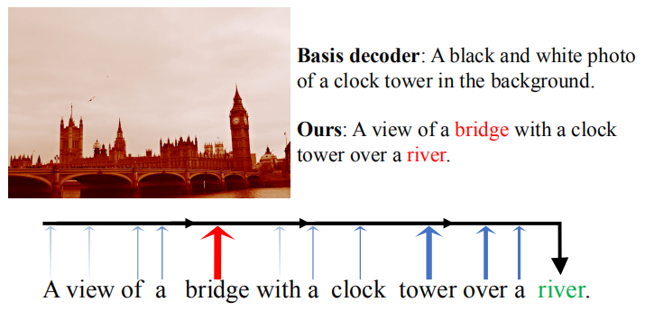
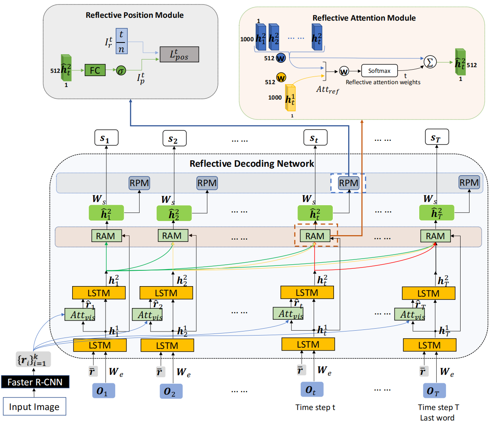
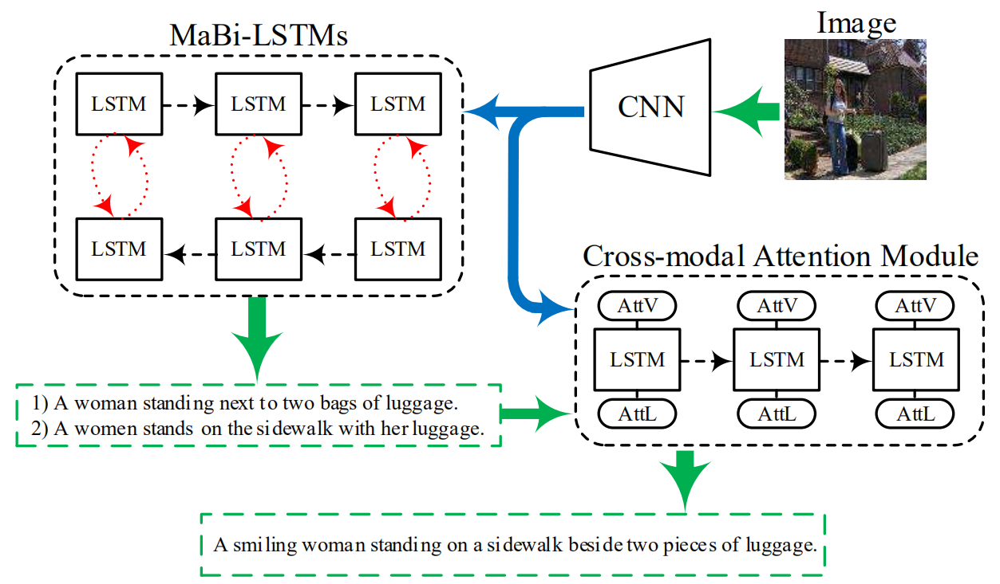
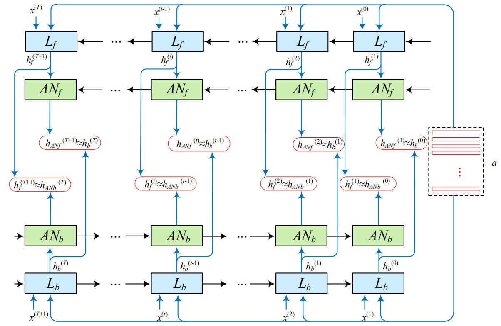
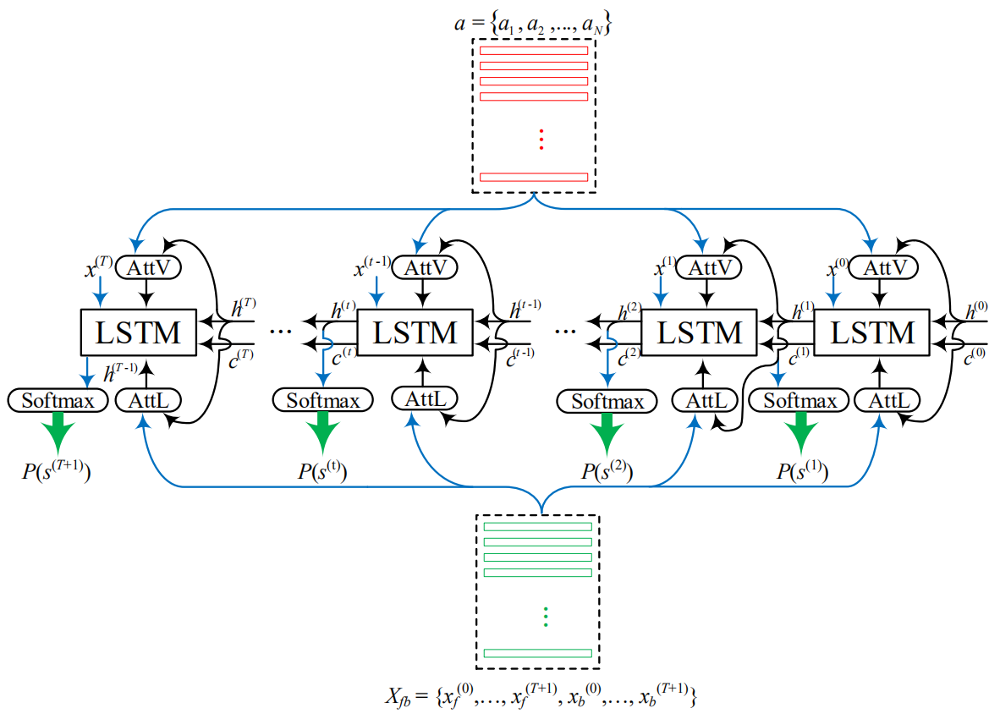

## 一、Reflective Decoding Network for Image Captioning, ICCV2019
> [自制PPT](https://github.com/ezeli/notes_in_BIT/raw/master/PPT/ICCV2019%20Reflective%20Decoding%20Network%20for%20Image%20Captioning.pptx)

### 1、解决问题
这篇论文认为当图片的内容比较复杂时传统的LSTM很难处理长期依赖问题，往往更关注于相对比较近的单词而忽略比较远的问题，如下图所示，“bridge”对“river”有很大的提示作用，但是它们之间相差6个单词，对于传统的LSTM来说很容易忽略这个。
<!-- more -->

### 2、模型
作者提出了Reflective Decoding Network (RDN)：1）同时在视觉和文本域使用注意力机制（这个其实不算创新，2018年的Bottom-Up and Top-Down Attention那篇论文就已经这么做了）；2）以监督的方式对描述中每个单词的位置信息进行建模，以捕捉自然语言的句法结构。模型的整体结构如下：

#### 主要包括以下三个组件：
**1）Attention-based Recurrent Module**
如上图所示，这个是模型的主体部分，主要用于对faster rcnn提取的区域特征向量（proposal）进行加权关注。主要就是来源于**Bottom-Up and Top-Down Attention论文**。
**2）Reflective Attention Module**
这个模块主要用于建模当前和过去的隐藏状态之间的关系，这里我感觉主要是参考了**Transformer论文**里面的decoder部分，就是在生成当前单词时不但考虑当前时间步的隐藏状态而且考虑之前所有时间步的隐藏状态，这样就不用担心随着时间步的增加损失很久的信息（也就是长期依赖问题）。
**3）Reflective Position Module**
因为自然语言的句法结构，很多单词的位置其实是比较固定的，比如“a man”常常出现在句子的开头，所以作者使用这个模块在训练时加入位置信息来捕捉句法结构。因为这个模块是有监督学习的，在训练时需要提前知道句子的长度，所以在推断阶段会忽略这个模块，因为无法提前知道句子长度。

## 二、Exploring Overall Contextual Information for Image Captioning in Human-Like Cognitive Style, ICCV2019

### 1、解决问题
作者认为当前的caption方法都是从头到尾来生成，生成某个单词时没有考虑到后面的信息。

### 2、模型
如下图所示，整体结构包括一个双向LSTM网络（MaBi-LSTMs）和一个跨域注意力模块（Cross-modal Attention Module）。

MaBi-LSTM使用一个双向的LSTM和一个辅助网络来生成句子，在正向生成时辅助网络帮助LSTM捕捉句子后半部分的信息，在反向生成时采用辅助网络捕捉句子前半部分的信息，主要结构如下：

这样，双向LSTM会生成两句话，之后作者使用跨域注意力模块将这两句话拼接到一起来生成最终的句子：

