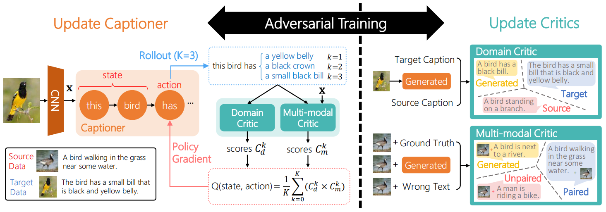
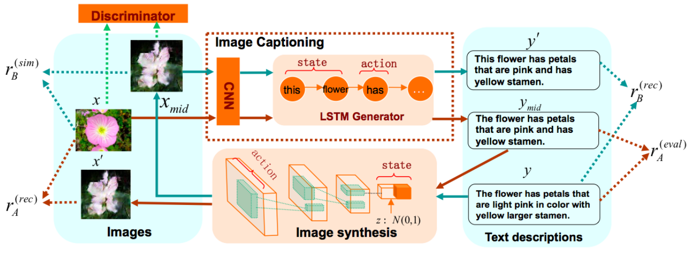

在配对的图片-文本描述数据集（下面称为源域）上，描述生成模型已经取得了不错的效果，但是由于配对数据获取是费时费力的，代价昂贵，所以产生了跨域图片文本描述任务，其目的是利用源域数据，给未配对的数据集（下面称为目标域）生成图片描述，但是由于不同的数据集之间存在域偏移，直接使用在源域上训练好的模型给目标域图片生成的描述，质量往往很差，此时，就可以使用迁移学习方法解决该问题。
<!-- more -->

## 一、Show, Adapt and Tell: Adversarial Training of Cross-domain Image Captioner, ICCV2017

### 1、总体介绍
作者提出了一个新的对抗性训练过程来利用目标域中未配对的图片和句子数据，从而让模型在目标域上达到了较好的效果。

如上图所示，作者提出的方法包括两个主要成分。第一个成分是标准的基于编解码的描述生成器，作者将它视为一个采取序列行为（比如生成单词）的智能体，并通过策略梯度方法进行训练。第二个主要成分包括两个评论家，用于给生成的描述提供奖励，其中域评论家评估生成的句子是否与目标域中的句子无法区分，多模态评论家以源域中配对的数据为例，评估图片及其生成的句子之间的相关性。并且在训练时，生成器和评论家进行对抗性训练，描述生成器的目的是产生无法区分的句子，而评论家的目的是区分它们。下面进行分别介绍：

### 2、描述生成器

在传统的方法中是通过交叉熵损失函数训练模型的，但是由于目标域中不包含和图片配对的描述，因此作者选择通过策略梯度的方法进行训练，并引入评论家来提供奖励：$R(y^{n}|x^{n},Y,\mathcal{P)}$，其中$y^{n}$表示生产的描述，$x^{n}$表示图片，$Y$表示目标域中的句子，$\mathcal{P}$表示源域中配对的数据。在时间步t，给定图片x和已经生成的部分句子$y_{t-1}$，生成一个新的单词$\mathcal{y}_{t}$的奖励定义为未来奖励的期望：

$$
Q\left( \left( x,y_{t - 1} \right),\mathcal{y}_{t} \right) = E_{y_{\left( t + 1 \right):T}}\lbrack R(\lbrack y_{t - 1},\mathcal{y}_{t},y_{\left( t + 1 \right):T}\rbrack|x,Y,\mathcal{P)}\rbrack
$$

给定奖励，最大化以下新的目标函数：

$$
J\left( \theta \right) = \sum_{n = 1}^{N}{J_{n}\left( \theta \right)}
$$

$$
J_{n}\left( \theta \right) = \sum_{t = 1}^{T_{n}}{E_{y_{t}^{n}}\lbrack\pi_{\theta}(\mathcal{y}_{t}^{n}|x^{n},y_{t - 1}^{n})Q\left( \left( x^{n},y_{t - 1}^{n} \right),\mathcal{y}_{t}^{n} \right)\rbrack}
$$

然而，由于$y_{t}^{n}$的空间很大，所以作者生成M个句子来以均值代替期望：

$$
J_{n}\left( \theta \right) \simeq \frac{1}{M}\sum_{m = 1}^{M}{J_{n,m}\left( \theta \right)}
$$

$$
J_{n,m}\left( \theta \right) = \sum_{t = 1}^{T_{m}}{\pi_{\theta}(\mathcal{y}_{t}^{m}|x,y_{t - 1}^{m})Q\left( \left( x,y_{t - 1}^{m} \right),\mathcal{y}_{t}^{m} \right)}
$$

上式的策略梯度为:

$$
\nabla_{\theta}J_{n,m}\left( \theta \right) = \sum_{t = 1}^{T_{m}}{\nabla_{\theta}\pi_{\theta}(\mathcal{y}_{t}^{m}|x,y_{t - 1}^{m})Q\left( \left( x,y_{t - 1}^{m} \right),\mathcal{y}_{t}^{m} \right)} \\ = \sum_{t = 1}^{T_{m}}{\pi_{\theta}\left( \mathcal{y}_{t}^{m} \middle| x,y_{t - 1}^{m} \right)\nabla_{\theta}\log{\pi_{\theta}\left( \mathcal{y}_{t}^{m} \middle| x,y_{t - 1}^{m} \right)Q\left( \left( x,y_{t - 1}^{m} \right),\mathcal{y}_{t}^{m} \right)}}
$$

则整个梯度为：

$$
\nabla_{\theta}J_{n}\left( \theta \right) \simeq \frac{1}{M}\sum_{n = 1}^{N}{\sum_{m = 1}^{M}{\nabla_{\theta}J_{n,m}(\theta)}}
$$

接下来，描述如何评估奖励Q。由于$y_{\left( t + 1 \right):T}$的空间同样很大，作者使用蒙特卡洛展开，以使用均值代替期望：

$$
Q\left( \left( x,y_{t - 1} \right),\mathcal{y}_{t} \right) \simeq \frac{1}{K}\sum_{k = 1}^{K}{R(\lbrack y_{t - 1},\mathcal{y}_{t},y_{\left( t + 1 \right):T_{k}}^{k}\rbrack|x,Y,\mathcal{P)}}
$$

### 3、评论家模型

域评论家是用于解决句子空间的域偏移问题的，它将句子分为源域句子、目标域句子和生成的句子三类。该模型包括一个编码器和一个分类器，首先使用带有高速连接的CNN将句子编码为向量表示，然后通过一个全连接层和一个Softmax层进行分类。

多模态评论家是为了评估图片x和句子y之间的相关性，它将(x,y)分为配对的、不配对的和生成的三类。该模型包括多模态编码器、模态融合层和一个分类器，其计算过程表示为：

$$
c = \text{LSTM}_{\rho}\left( y \right)
$$

$$
f = \tanh\left( W_{x} \bullet x + b_{x} \right) \odot \tanh\left( W_{c} \bullet c + b_{c} \right)
$$

$$
C_{m} = softmax(W_{m} \bullet f + b_{m})
$$

其中，$\odot$表示对应元素相乘，$C_{m}$表示三种类别的概率分布。

最终，句子奖励定义为：

$$
R\left( y \middle| . \right) = C_{d}(target|.) \bullet C_{m}(paired|.)
$$

其中$C_{d}(target|.)$表示域评论家认为句子来自目标域的概率，$C_{m}(paired|.)$表示多模态评论家认为图片和句子是配对的概率。

在训练评论家模型时，采用监督学习的方法，以交叉熵损失函数训练即可。

### 4、训练

在进行对抗性训练时，给定图片x，生成句子y，描述生成器的目的是为了得到更大的奖励$R\left( y \middle| . \right)$，而评论家的目的是为了得到更大的$C_{d}(\text{generated}|y)$和$C_{m}(\text{generated}|x,y)$。总之，首先在源域数据上使用交叉熵损失对生成器进行预训练，之后采用$N_{g}:N_{c}$的比率迭代地更新生成器和评论家，其中评论家比生成器更新得更频繁。

## 二、Dual Learning for Cross-domain Image Captioning, CIKM2017

### 1、总体介绍
作者为跨域图片文本描述任务提出一个新的对偶学习方法，它能够有效利用源域和目标域中的数据。首先，在预训练阶段，使用源域数据进行监督学习，训练一个编解码模型来生成图片描述，同时训练一个基于文本的图片生成模型，它能够通过读取一个有意义的句子来合成一张图片。在微调阶段，作者通过一种对偶学习机制，在有限配对（或者未配对）的目标域数据上进行训练，此时会同时优化两个耦合的任务：图片描述生成任务和从文本描述生成图片任务，并且探索这两个任务之间的关系可以提高目标域中图片描述生成的性能。

对于图片描述生成模型，采用CNN低层提取出的特征集合表示图片，并且通过软注意力机制让模型生成描述时动态关注图片的不同区域。对于图片合成模型，使用深度卷积生成对抗性网络（DC-GAN）来实现，它包含一个生成器和一个鉴别器，生成器用于读取文本描述并生成一张图片，鉴别器用于评估该图片和文本描述匹配的程度。

### 2、对偶学习方法

下面介绍在微调阶段的对偶学习方法。如上图中红线所示，可以从图片描述生成开始：首先通过描述生成模型为图片生成一个中间描述，之后通过图片合成模型为中间描述反向生成一张图片，最后，通过评测这两个过程的生成结果，则可以采用策略梯度算法同时优化两个模型的参数，之后可以迭代多次直到算法收敛。在这个过程中，可以为图片描述生成模型提供两种奖励：

1）**重建奖励** 使用原图$x$和生成的图片$x'$之间的负平分差作为重建奖励：

$$
r_{A}^{(rec)} = - {||x - x'||}^{2}
$$

2）**评估指标奖励** 当目标域中有少量配对的数据时，可以采用评估指标作为奖励来优化模型：

$$
r_{A}^{(\text{eval})} = \frac{\text{BLEU}\left( y_{\text{mid}},y \right) + CIDEr(y_{\text{mid}},y)}{2}
$$

最后，将上述两种奖励进行线性组合构成全部的奖励$r_{A}$（当目标域中没有配对数据时则只采用重建奖励）。

同理，如图3-2中绿线所示，也可以从图片合成开始：首先为句子生成一个中间图片，再为中间图片生成一句描述，最后评测结果并进行模型优化。在这个过程中，可以为图片合成模型提供两种奖励：

1）**重建奖励** 给定由句子$y$生成的中间图片$x_{\text{mid}}$，作者采用重建句子的对数概率作为重建奖励：

$$
r_{B}^{(rec)} = \log{P(y|x_{\text{mid}},\theta_{A})}
$$

2）**相似性奖励** 同样当目标域中有少量配对的数据时，可以通过评估真实图片$x$和生成的中间图片$x_{\text{mid}}$之间的相似性作为一种奖励：

$$
r_{B}^{(sim)} = - {||x - x_{\text{mid}}||}^{2}
$$

最后同样采用上述两种奖励的线性组合作为全部的奖励。
