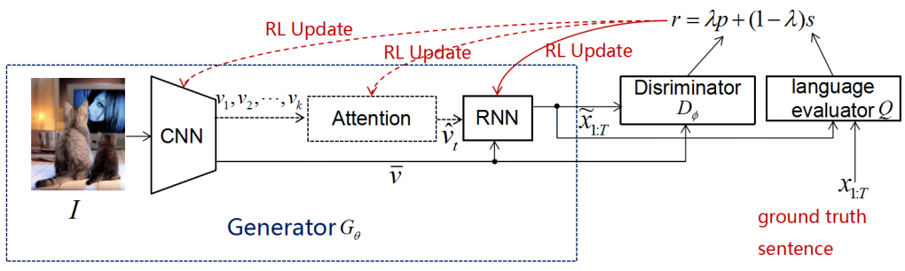
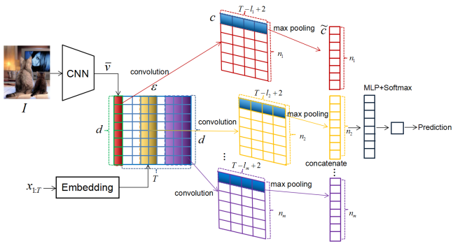
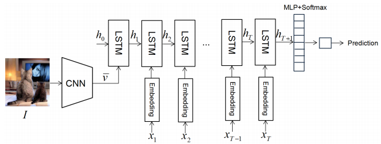
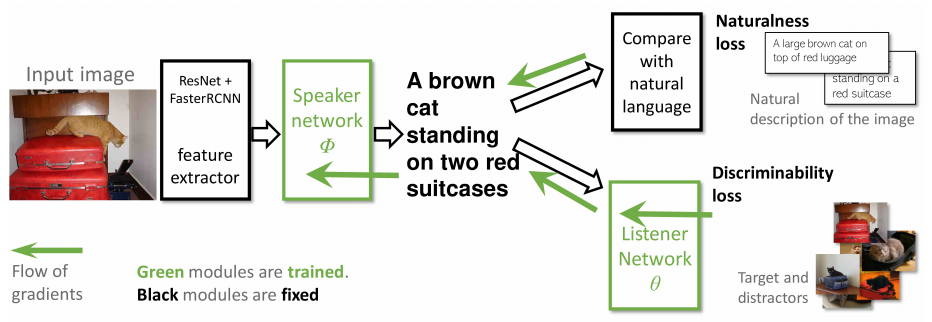
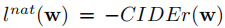
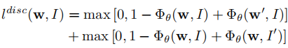

## 一、Improving Image Captioning with Conditional Generative Adversarial Nets, AAAI2019

这篇论文的思路很简单，就是引入GAN来提高模型生成描述的质量，这种方法是通用的，可以加入到所有的基于强化学习的模型中。模型的整体框架如下所示：
<!-- more -->

其中，使用鉴别器和语言评估器两个模块来平衡保真度（在客观评价指标下得到高分）和自然度（类似人类的语言风格）。

作者引入了基于CNN和基于RNN的两种鉴别器：
**1）基于CNN的鉴别器**

将CNN提取出的图片全局特征向量和句子中每个单词的嵌入表示连接起来组成特征图，之后使用多组不同窗口大小的卷积核对特征图进行一维卷积，再对每组卷积结果进行最大池化，并将池化结果连接，在输入到最后的全连接层时通过加入highway结构提高性能。

**2）基于RNN的鉴别器**

由一个标准的LSTM、一个全连接层和一个softmax输出层组成。由CNN提取出的图片全局特征向量作为第一个时间步的输入，之后句子中每个单词的嵌入表示作为每个时间步的输入。

训练时，每种鉴别器都观测到三种输入对：真实对（真实句子和匹配的图片）、假对（生成的句子和匹配的图片）、错误对（真实句子和不匹配的图片）。经过试验表明生成器和鉴别器各训练一次进行迭代效果最好，并且两种鉴别器各有优势：基于CNN的模型效果稍微好于基于RNN的模型，但是训练时基于RNN的模型能够节省30%的时间。

## 二、Joint Optimization for Cooperative Image Captioning, CVPR 2019

这篇论文联合训练一个“speaker”网络和一个“listener”网络，来提高生成图片描述的可区分度，speaker就是正常的caption模型，用于生成图片对应的描述，而listener的目的是根据speaker生成的描述从给定的一组图片中找到对应的图片，这样可以使生成的描述具有区分度，而不是通用的语句。模型结构如下：

如上图所示，损失分为两部分，自然性损失和可区分性损失。对于自然性损失，采用强化学习的方式优化，使用CIDEr得分：

对于可区分性损失，采用两个hinge损失的和：

W’是图片I对于的负样本描述，I’是描述W对于的负样本图片。在训练时，listener自身使可微的，因此参数可以按照正常的梯度下降进行优化。但是由于speaker和listener之间是通过离散的单词序列连接的，因此不可以直接反向传播，这篇论文提出以下方式学习speaker：

Speaker生成描述时，在每个时间步，以p的概率直接将该时间步的输出输入给listener，这样就转换成了可微分的，可以直接计算确定的梯度进行反向传播，以1-p的概率将采样的结果（一个one-hot向量）输入给listener，这样，采用强化学习的方式将loss传给listener。这种方式有两个有点：对于p的概率，梯度是确定的，所以可以降低模型的偏差和方差；对于1-p的概率，listener通过采样得到的one-hot向量学习分类，这样在测试阶段，它就能够正确地处理观测到的one-got样本。

在评估模型时，生成描述的自然性通过标准的的CIDEr , BLEU4, METEOR, ROUGH和SPICE来评价，可区分度通过listener网络的recall指标来评价。
