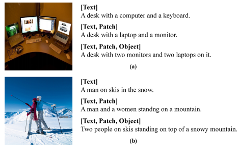

## 一、Hierarchical Attention Network for Image Captioning, AAAI 2019
> [自制PPT](https://github.com/ezeli/notes_in_BIT/raw/master/PPT/AAAI2019%20Hierarchical%20Attention%20Network%20for%20Image%20Captioning.ppt)

### 1、解决问题
这篇论文认为现有的注意力机制只关注单层特征，比如低层的空间特征或者高层的文本特征，但是描述语句中不同的单词和不同层次的特征有关，比如颜色单词可以从低层特征预测，量词可以从中层特征预测。所以作者提出了一个
Hierarchical Attention Network (HAN)，能够同时考虑多层特征，如下图所示：
<!-- more -->

**Text**表示强语义的文本特征，是指和图像相关的语义概念，包括形容词、动词和名词，之后将单词转换为词嵌入向量。作者使用一个图片分类检测器进行检测（论文中每张图片检测10个概念单词），结构如下：

目标函数：

其中N表示类别数（论文中取2000），如果groundtruth中对应的单词存在则pi*为1。

**Patch**表示弱语义的块特征，使用在ImageNet上预训练的Resnet101的最后一个卷积层提取，每张图提取196个块特征。

**Object**表示语义适中的显著目标的特征，使用Faster
RCNN提取，每张图片提取15个特征。

### 2、方法
模型整体结构图如下：

公式如下：

#### 1）Attention module

V表示某个层次的特征，三个层次的特征分别有独立的相同的注意力模型。

#### 2）Multivariate Residual Module
用于整合不同层次的特征，将特征投影到一个统一的目标空间中，探索不同层次的特征空间之间的内在关系，包括projection和Relation两个部分。

**Projection部分**：将patch attention特征和text attention特征投影到object空间：

**Relation部分**：探索不同模态特征之间的内在联系：

**MRM**：M = H + R

**pMRM (parallel MRM)**：将多层次特征融合分成两条路，一条是content
pathway，一条是position
pathway，将object信息提供给patch特征和text特征，之后使用context
gate选择性地关注高层次的内容特征和低层次的位置特征：

## 二、Deliberate Attention Networks for Image Captioning, AAAI2019

### 1、解决问题
之前带有注意力机制的编解码框架都是一次前向过程，当模型预测一个单词时，只利用了已经生成的单词而不会考虑未生成的单词，但是对于人类来说，反复考虑是阅读、写作、理解图片等日常生活中常见的行为，这一过程会利用过去和未来的全局的信息。作者提出一个新的网络结构：Deliberate
Residual Attention Network（DA），能够考虑到全局的信息。

### 2、方法
模型结构图如下：

包括三个部分：两个基于残差的注意力层和一个强化学习模块。第一个注意力层目的是准备隐藏状态和视觉注意力特征，用于生成描述的初步版本，第二个注意力层通过利用第一层的输出信息完善描述。

在训练时，首先使用MLE预训练模型，之后使用强化学习微调参数，将对抗损失（CL）和CIDEr组成奖励函数。其中，CL定义为：先分别使用CNN和RNN提取图片和描述的特征向量，之后通过线性变换将两个向量投影到同一空间，并通过余弦相似度度量它们之间的相似性，最后通过两个常见的hinge损失组成对抗损失：

