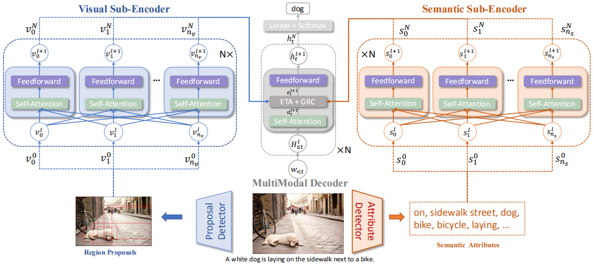
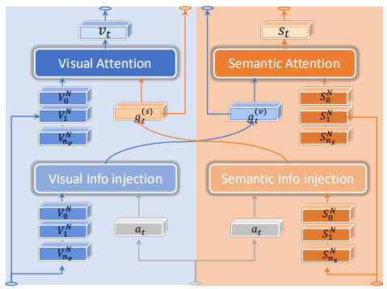
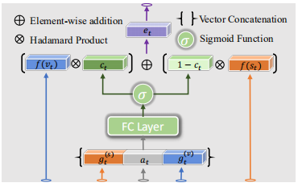
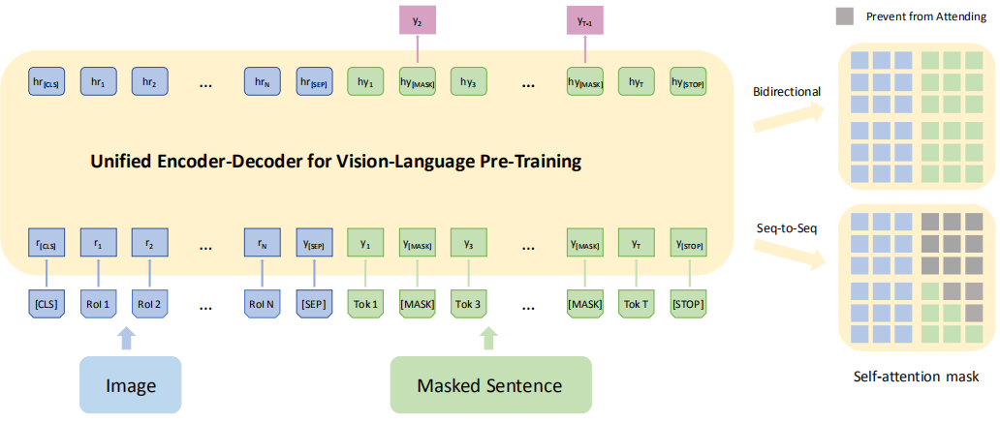

## 一、Entangled Transformer for Image Captioning, ICCV2019

### 1、解决问题

之前的注意力机制主要分为两种：视觉注意力和语义注意力，对于视觉注意力来说，能够探索图片底层的特征或者高层的显著对象特征，但是由于视觉和语言之间存在差异，描述中不是每个词都有对应的视觉信号，特别是对于一些抽象概念词和复杂的关系词。对于语义注意力来说，能够直接利用高层的语义信息，但是由于RNN的长期依赖问题，很难记忆很多步之前的输入信息，尤其是最初的视觉输入，导致模型倾向于生成一些高频短语而不考虑视觉信息。并且之前的方法要不只考虑一种注意力，要不分开考虑两种注意力然后在进行融合，这样不能同时探索两种注意力之间的互补关系。
<!-- more -->
### 2、方法

作者对Transformer进行扩展，代替了传统的RNN模型，设计了 Entangled Attention (ETA) 模块来同时探索视觉和语义信息，并且提出了 Gated Bilateral Controller (GBC) 模块，这是一种双边门控机制能够控制多模态信息的传播。模型整体架构如下：

模型主要包括三个部分：视觉子编码器、语义子编码器和多模态解码器。生成描述的过程分为三步：检测图片的候选区域和语义属性；分别编码视觉和语义特征；逐词生成描述。

#### 1）编码器

如上图所示，视觉和语义两个子编码器都使用了Transformer的编码器部分，并使用了相同的配置，这样可以避免RNN的长期依赖问题。

#### 2）解码器

在Transformer解码器的self-attention和feed-forward层之间加入ETA和GBC模块作为解码器。

**ETA模块：**

通过注入的方式将视觉和语义两个模态的信息交叉联系在一起，相互影响

**GBC模块：**

通过门控机制整合两个模态的信息。

论文主要的创新就是将Transformer的思想引入了image caption任务，并加入了自己的创新使模型和任务更加契合。

## 二、Unified Vision-Language Pre-Training for Image Captioning and VQA, AAAI2020

### 1、主要思想

作者提出一个统一的编解码模型：Vision-Language Pre-training（VLP），想法和实现都主要来自于NLP领域的BERT模型，该模型首先在两个任务上进行预训练，之后经过微调即可在多个下游任务达到很好的效果。

### 2、方法

VLP 使用共享的多层 transformer 网络进行编码和解码，这不同于许多现有的方法，它们的编码器和解码器是使用单独的模型实现的。VLP 在大量的图片-描述对上进行预训练，优化两个无监督预测任务：**bidirectional and seq2seq masked language prediction**，两项任务的区别仅在于预测所基于的上下文不同，在双向预测任务中，要预测的掩码描述单词的上下文由所有图像区域以及描述中左右两侧的所有单词组成，在 seq2seq 任务中，上下文由所有图像区域和标题中待预测单词左侧的单词组成；之后可以针对视觉语言生成任务（例如，image captioning）或理解任务（例如，VQA）进行微调，并得到很好的效果。模型结构和两个预训练任务如下图所示：

任务的一般设置都和 BERT 相同，其中两个任务最主要的差别就是：双向预测任务中待预测单词两侧的所有单词都认为是已知的，都要输入，而对于 seq2seq 任务，只能输出待预测单词左侧的单词，之后的单词是未知的（未来的）。

预训练 VLP 模型后，作者使用 seq2seq 目标针对 image captioning 任务进行微调。在生成描述时，输入除了提取出的图片特征外还包含之前已经生成的单词以及一个特殊的 `[mask]` 标志，第一次输出时只有特殊标志，最后对输出结果进行采样得到预测的单词，直到生成 `[STOP]` 标志。

这篇论文最主要的创新就是引入了 NLP 中 BERT 的想法，先用几个任务对模型进行初始化，之后只需要针对某个下游任务进行微调即可，这样既可以节省计算代价、快速训练，也可以在下游任务上减少数据量。
