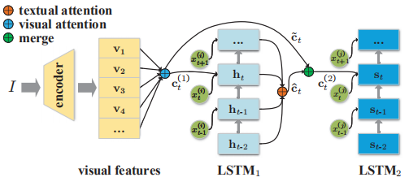
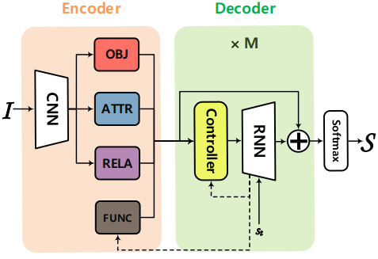
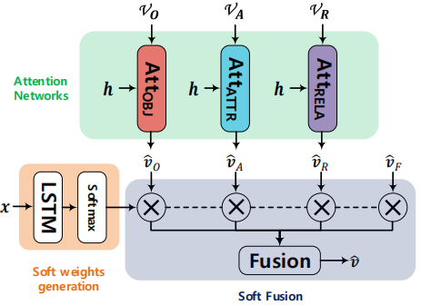

## 一、Generating Diverse and Descriptive Image Captions Using Visual Paraphrases, ICCV2019

### 1、解决问题

计算机更喜欢生成流畅正确但是简单模糊的描述，因为这样的描述更加“安全”，能够描述图片中显著的区域，但是会忽略细节。描述相同图片的不同的句子被称为visual paraphrases，之前的方法会忽略它们之间的联系，直接把它们作为不同的样本，而作者探索了它们之间的关系并使用一系列打分函数选择了一些visual paraphrase对（Ci，Cj），打分函数衡量了visual paraphrases在某种特征（比如多样性）上的差异，而Cj在这种特征上比Ci更“复杂”，比如Cj比Ci更丰富，训练时，模型首先更加视觉特征生成初始描述Ci，之后再融合视觉特征和Ci提供的文本特征生成更加丰富多样的Cj。
<!-- more -->
### 2、方法

模型结构如下：

和之前的工作类似，首先将提取出的视觉特征集合通过注意力机制融合到一起，LSTM1用该特征生成Ci，之后将Ci对应的LSTM1的隐藏状态集合通过门控机制融合到一起，LSTM2根据融合的特征生成Cj。

几种打分函数：

1）句子长度：一般来说句子越长提供的信息越多，所以Cj的长度大于Ci。

2）句法复杂性：句子结构越复杂表示可能会有更多的修饰词来提供细节描述，采用Yngve分数（测量了句法树中分支的数目）来衡量句法复杂性，所以Cj比Cj的Yngve分数要高。

3）TF-IDF多样性：句子n元组的TF-IDF衡量了句子的多样性。

4）图像检索排名：通过图片检索表示描述的可分辨性。

四种打分函数分别针对不同的特征，通过设置Ci和Cj之间的打分差异阈值，得到一组visual paraphrase对，用于训练模型的不同阶段。

这篇论文的一个新思路是探索了ground truth里面同一图片不同描述之间的联系。

## 二、Learning to Collocate Neural Modules for Image Captioning, ICCV2019

### 1、解决问题

Image caption任务很容易受到数据集偏差的影响，比如，在MSCOCO数据集中，“man”和“standing”同时出现的概率高达11%，所以一个好的模型（得分高）很喜欢去生成“man standing”，而不考虑实际的视觉内容。认知科学的研究表明，我们不是从零开始一个词一个词的说一句完整的话，相反，我们首先构成一个模板，然后用概念词填充模式，直到整个句子完成。传统的基于模板的方法，由于生成模板和生成单词不是一起联合训练的，所以性能受限；而现在基于编解码的方法大多数是逐词生成描述。作者提出了学习配置神经模块（learning to Collocate Neural Modules，CNM），充分利用了两者的优点，可以通过结构模式和端到端的训练来生成描述。

### 2、方法

结构图如下：

主要包含四个神经模块（用于生成对应的特征），一个控制器（用于对四个特征进行soft融合），从RNN到FUNCTION模块和模块控制器的虚线意味着这两个子网络都需要已生成的部分描述的上下文知识。四个神经模块设计都较为简单（细节参考论文），控制器设计如下：

VO、VA、VR、vF分别表示由四个神经模块提取出的特征，控制器会生成一个四维的注意力分数，采用soft机制对特征进行加权并连接组成最后的输出。

为了确保每个模块从图像中学习到正交和重要的知识，作者为控制器设计了Linguistic Loss：首先提取出ground truth中所有描述的单词的词性标注，并用四维的one-hot向量表示（名词，形容词，动词\|介词\|量词，其他词性），并将这作为ground truth，使用交叉熵来优化控制器生成的soft注意力分数。并且在训练时，再加入描述的MLE和强化学习损失构成整个模型的损失函数。

该论文一个主要的想法就是想出一种方式利用ground truth的词性序列信息。
