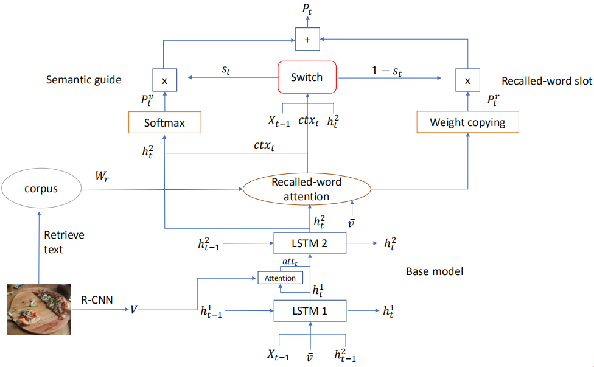

## 一、More Grounded Image Captioning by Distilling Image-Text Matching Model, CVPR2020

### 1、解决问题

注意力机制的目的是为了让模型在生成对应单词时将注意力集中到正确的物体上，这种能力被称为grounded image captioning，但是现有模型的定位精度远远不能令人满意，并且如果为了提高定位精度而收集单词-区域对齐数据作为强监督信息，代价是很昂贵的。因此，作者提出Part-of-Speech enhanced image-text matching model（POS-SCAN）作为一种知识提取方法来规范模型的注意力，为模型提供一种弱的定位监督信息。所谓的“弱”是由于POS-SCAN只依赖于图片-文本对齐，而不需要昂贵的单词-区域对齐。
<!-- more -->
### 2、方法

如上图所示，模型主要包括图片-文本匹配模型和描述生成模型两个部分。

#### 1）图片-文本匹配模型

作者使用经典的图片-文本匹配模型SCAN为强化学习阶段提供奖励，并且使用词性增强SCAN（POS-SCAN）作为注意力指导。

首先将提取出的图片区域特征映射到合适的维度，之后使用双向GRU对文本中的每个单词进行编码，并且单词最终的编码为GRU两个方向输出的隐藏状态的均值：

然后，为所有单词-区域对计算余弦相似度并进行标准化，之后，计算出每个单词所对应的注意力图片特征向量：

最后，图片和句子的全局匹配相似度计算如下：

模型的目标函数为：

在实验中，作者发现上述原始的SCAN模型定位的精度甚至比不上所采用的描述生成器，这可能是受到了句子中有太多非视觉单词的影响。所以在作为注意力指导时，作者使用词性标签对SCAN模型进行了增强（POS-SCAN），将全局匹配相似度计算式子重写为：

其中，当单词的词性为名词时指示函数取值为1否则为0。在这篇论文中，作者只保留了名词，但是将该模型称为POS-SCAN而不是noun-SCAN的原因是：未来其他词性的单词也可以无缝加入到该模型中。

#### 2）训练过程

首先使用图片-文本配对数据对SCAN和POS-SCAN模型进行预训练，之后固定它们的参数。描述生成模型采用Up-Down模型，其训练过程分为两个阶段：

第一个阶段使用交叉熵损失函数训练模型，并且通过KL散度，使用从POS-SCAN模型提取的注意力权重来对原本的注意力权重进行正则化，组合的损失函数为：

并且，如果包含区域-单词对齐标注数据，损失函数可以改为：

其中，当图片区域和真实的区域标注的IoU超过0.5时Y取1，否则取0。

在第二个阶段，使用强化学习方式进行训练：

其中baseline的句子是通过贪婪解码获得。对于奖励函数，除了CIDEr指标外，作者还加入了原始SCAN模型计算出的匹配分数：

## 二、Show, Recall, and Tell: Image Captioning with Recall Mechanism, AAAI2020

### 1、解决问题

一些方法会使用检测技术获取对象和属性词，并在生成描述时作为先验知识，但是没有建立引导词和生成的词之间的联系。作者提出一个回顾机制，包括三个部分：recall unit, semantic guide (SG) and recalled-word slot (RWS)，使用一个图片文本匹配模型作为recall unit，用于检索图片中的recalled word，SG分支用于生成描述，RWS分支用于处理检测出的单词，并使用soft switch平衡两个分支生成单词的概率。

### 2、方法

模型结构如下图所示：

生成描述流程：首先检测出图片包含的对象和属性词；通过Recalled-word attention计算这些单词的权重并加权求和得到特征向量ctx；在SG分支，使用ctx和base model（Up-Down）的隐藏状态计算出生成单词的概率分布；在RWS分支，直接复制检测出的单词的注意力分数作为概率分布，未检测出的单词都设置为0；最后通过soft switch机制将两个分布加权相加作为最后的单词概率分布。

训练时采用MLE预训练模型，采用强化学习微调，其中奖励函数处了CIDEr，还设计了Recalled-word
reward：

其中第一项是通过最后的概率分布采样的结果，第二项是通过SG分支得到的概率分布采样的结果，这样，可以证明RWS分支有多少改进。损失函数如下：

