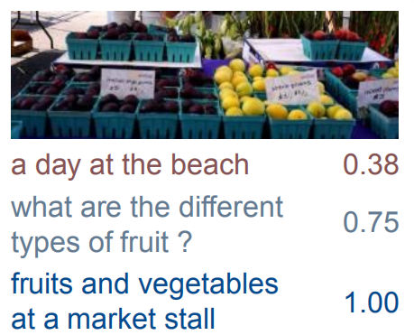
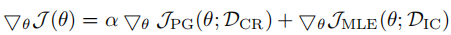
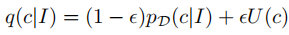
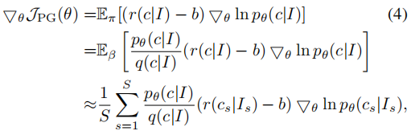
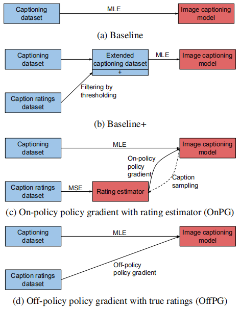
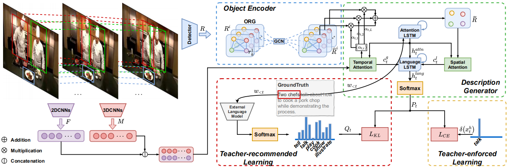
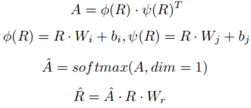
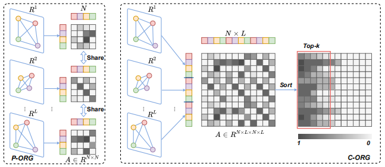

## 一、Reinforcing an Image Caption Generator Using Off-Line Human Feedback, AAAI2020
> [自制PPT](https://github.com/ezeli/notes_in_BIT/raw/master/PPT/AAAI2020%20Reinforcing%20an%20Image%20Caption%20Generator%20Using%20Off-Line%20Human%20Feedback.pptx)

### 1、解决问题

之前模型主要是通过最大似然估计（MLE）以及使用CIDEr等手工设计的评价指标作为奖励函数的强化学习的方式进行优化，但是这些优化方法是受限的，我们人类对模型生成描述的质量评估可能并不高。
<!-- more -->
### 2、方法

我们对模型性能进行人类评估时会产生一个副产品：带有人类为模型生成的图片描述进行质量打分标注的的数据集，如下图所示，具体来说，由几个模型为每张图片分别生成描述，然后由几个人对每句描述进行质量打分，最后对同一个描述的多个分数求均值。

作者使用强化学习的方式，将这种质量打分作为奖励函数来优化模型。整体训练流程为：先在常用的caption数据库上使用MLE预训练模型，之后在带有打分标注的数据集上使用强化学习的方式进行微调，并且为了在微调时避免过拟合，采用MLE损失作为正则项，公式如下：

DCR表示caption ratings数据集，DIC表示caption labeled数据集。

由于这种带有打分标注的数据集是很小的，大部分的描述并没有真是的质量打分，所以作者提出两种方式利用这些信息：

**On-policy policy gradient with rating estimates**：主要思想就是先使用caption ratings数据集训练一个描述打分评估器，之后训练时使用该评估器的打分作为奖励函数，但是这种方式严格依赖于评估器的质量，作者发现这种方法对模型的性能有很负面的影响，常常会生成不合语法的描述。

**Off-policy policy gradient with true ratings**：这种方式会使用真实的打分，在训练时采用以下的采样概率：

其中ε远小于1，表示大概率采样到带有打分标注的描述，如果采样到没有打分的描述，将reward设置为baseline，确保训练时不受没有打分标注的描述的影响，公式如下：

其中p表示caption ratings数据集采样的真实概率分布，p/q表示采样得到的图片I和描述c的重要性权重。

各种训练方法示意图如下：

## 二、Object Relational Graph with Teacher-Recommended Learning for Video Captioning, CVPR2020

### 1、解决问题

现有的方法由于忽略了时空域中物体的相互关系，所以缺乏足够的视觉表示；并且由于long tail问题（即在图片描述语料中，大多数词是虚词和常见词，比如“the”、“man”，这些词的数量远远超过了真正的和内容相关的词），对内容相关的单词缺乏充分的训练。

### 2、方法

结构图：

主要流程：首先构造一个可学习的物体关系图（ORG）用于探索物体之间的时空关系，并且在关系推理的过程中增强物体的特征表示；之后在训练时，除了常规的使用ground truth（作者称ground truth单词为hard target）进行训练（作者称为teacher-enforced learning , TEL），作者为了解决long tail问题，还提出了teacher-recommended learning (TRL)方法：首先使用额外的语言模型（ELM）根据当前ground truth单词的预测概率生成一些候选单词（作者称为soft targets，它们往往在语义上和ground truth相似），之后使用这些候选单词进行训练，其中ELM被认为是一个经验丰富的老师，会事先在额外的大规模语料库上进行训练。

#### 1）基于视觉编码器的物体关系图

首先均匀提取一些帧作为关键帧，并收集围绕关键帧的短距离视频帧，作为反映视频时间动态的片段，之后使用预先训练的2D和3D CNN分别提取关键帧和片段的特征。使用预训练的物体检测器提取每个关键帧的物体和对应的特征，这些原始的物体特征都是独立的，为了探索它们之间的关系，用于更新物体特征表示，作者定义了一个物体关系图，特征更新过程如下：

其中，R∈K\*d，表示K个d维的物体特征，A∈K\*K表示关系系数矩阵。

为了探索物体之间的时空关系，作者提出两种关系图：部分关系图（P-ORG）和全体关系图（C-ORG），P-ORG分别对每一帧的所有物体进行关系建模，其中参数是共享的，C-ORG对视频中所有的物体进行关系建模，由于物体较多，所以只选择前k个最相关，如下图所示：

#### 2）描述生成

如结构图所示，包括两个LSTM和时、空注意力模块。时间注意力模块用于动态决定注意那一帧，并提取全局的上下文特征；对于空间注意力模块，首先分别计算第一帧中所有物体特征和其他帧中物体的余弦相似度，之后根据最高的相似度进行匹配，将所有帧中的物体进行对齐，并根据时间注意力模块计算出的注意力分数对不同帧中同一物体进行加权求和，用于增强物体的特征表示，最后空间注意力模块选择关注哪个物体。

#### 3）通过ELM进行TEL

使用现成的已经训练好的Bert、GPT等作为ELM，给定前t-1个已经生成的单词，ELM会输出第t时间步的概率分布。作者提出的模型表示为CAP，为了将ELM中知识迁移到CAP，可以最小化CAP和ELM输出的概率分布（分布表示为P和Q）的KL散度，让P拟合Q，注意只取Q中前k个作为soft targets。

在整体训练时采用TEL和TRL共同训练。
