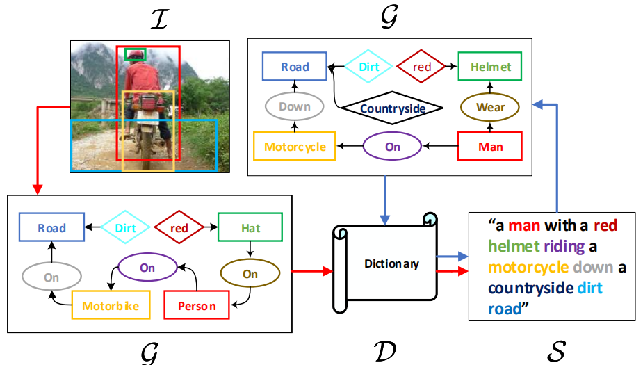
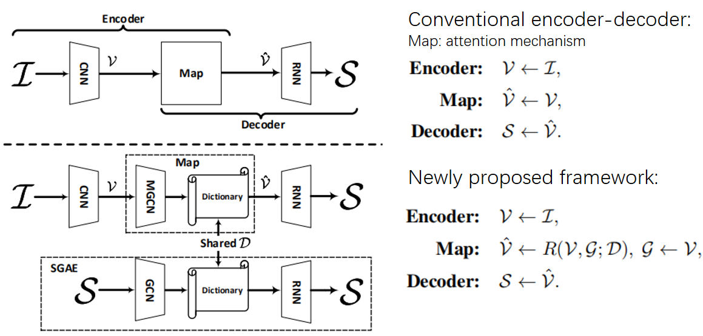
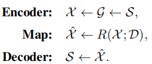
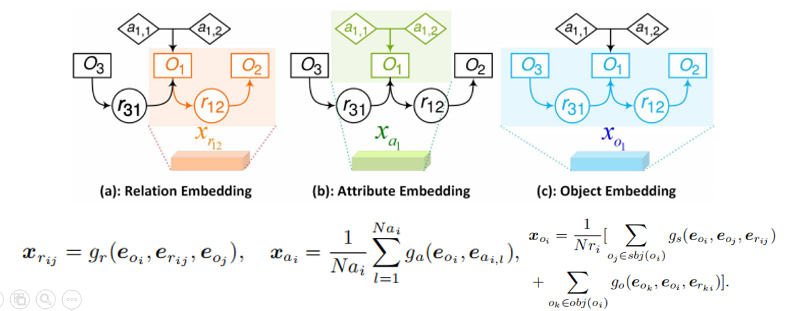
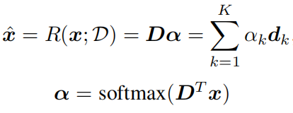
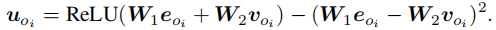
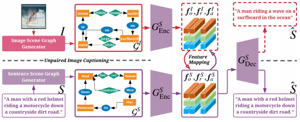
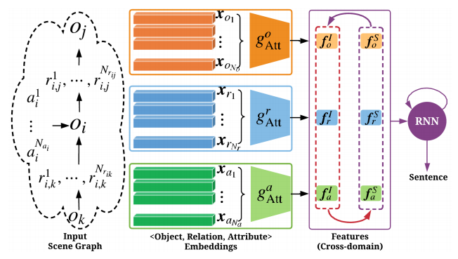
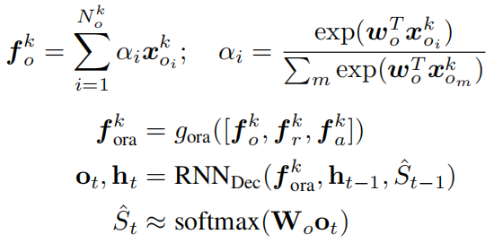
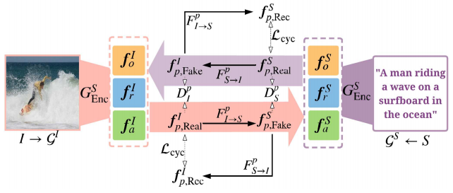

## 一、Auto-Encoding Scene Graphs for Image Captioning, CVPR2019
> [自制PPT](https://github.com/ezeli/notes_in_BIT/raw/master/PPT/CVPR2019%20Auto-Encoding%20Scene%20Graphs%20for%20Image%20Captioning.pptx)

### 1、解决问题

当我们看到“person on bike”，我们会很自然的把“on”替换成“ride”并且推理出“person riding bike on a road”即使“road”并没有出现，我们人类能够通过这种inductive bias（归纳能力、常识、先验知识）来进行单词搭配和语境推理。因此，探索这种推理可以让模型不过度拟合于数据集偏差而专注于推理。之前的工作中，当我们将一个看不见的图像场景输入到模型中时，通常会得到一个简单而没有价值的关于显著物体的标题，例如“there is a dog on the floor”，这比目标检测得到的结果好不了多少。
<!-- more -->
### 2、方法

结构图：

包括两条路，一个用于句子重建：S -\> G -\> D -\>S，目的是为了学习Dictionary（D，对语言先验知识进行编码）；另一个用于图片描述生成：I -\> G -\> D -\> S，使用共享的D将inductive bias从纯语言域迁移到视觉-语言域。

和传统的方法进行比较：

#### 通过句子重建过程学习字典D

1）图的定义：G = (N , E)

N表示结点，包含物体oi（第i个物体）、属性ai,l（第i个物体的第l个属性）和关系rij（物体i和物体j之间的关系）三种结点，分别表示为d的向量，即eo、ea、er。

E表示边：物体和它的属性之间有一条从属性指向物体的边；一个关系三元组\< oi—rij—oj\>表示两条有向边。

2）S -\> G

使用SPICE（一种评估指标）中的方法将句子转化为场景图：首先将句子解析为句法依存关系树，然后使用一种基于规则的方式将树转化为场景图。

3）G -\> X

目的就是将原始的结点编码转换成一组上下文相关的编码X，包含三种结点对应的三种嵌入表示。作者使用四种图卷积（四个结构相同但是独立的网络）生成X，流程：将输入向量连接，通过一个全连接层，最后输入ReLU激活函数中，如下图所示：

4）Map

x∈X

5）Decoder

采用注意力机制（Up-Down）重建句子，使用MLE和RL训练模型。

#### 整个模型：SGAE-based Encoder Decoder

1）多模态图卷积网络

使用Faster RCNN作为物体检测器，MOTIFS作为关系检测器，并且自己设计了一个属性检测器：一个小的fc-ReLU-fc-Softmax网络头。

物体结点表示：将通过预训练的Faster RCNN提取的RoI特征与检测出的标签嵌入表示融合得到：

关系和属性结点也是以相同的方式表示。

和图卷积网络类似，多模态图卷积网络也使用四个方法对特征进行处理，包括两层结构：fc-ReLU。

2）训练

使用SGAE预训练的D作为初始化，并且使用MLE和RL进行训练。

## 二、Unpaired Image Captioning via Scene Graph Alignments, ICCV2019
> [自制PPT](https://github.com/ezeli/notes_in_BIT/raw/master/PPT/ICCV2019%20Unpaired%20Image%20Captioning%20via%20Scene%20Graph%20Alignments.pptx)

### 1、解决问题

现有的方法严重依赖于配对数据，但是这些数据的获取是费时费力的；在无监督神经机器翻译任务中，源语言和目标语言之间可以共享编码器，但是由于图片和句子的结构和特征不同，所以不能通过共享编码器连接两种模态。

### 2、方法

结构图：

包括一个视觉场景图生成器、一个现成的句子场景图生成器、一个场景图编码器、一个句子生成器和一个特征映射模块。

流程：首先使用现成的句子场景图生成器提取出语料的场景图，然后在文本数据集上使用MLE和RL训练场景图编码器和句子生成器；使用视觉场景图生成器提取图片的场景图并通过场景图编码器进行编码，然后将它映射到句子模态空间，最后句子生成器生成描述。

图片和句子的场景图生成器以及场景图编码器和上文相似。

#### 句子生成器

场景图编码后得到三种类型的嵌入向量表示，由于它们的重要性不同，作者使用三个注意力模块来计算解码的相关内容，如下图所示：

#### 场景图特征映射

通过CycleGAN的方式进行映射训练。

训练时除了使用Discriminator提供的损失，还加入了cycle consistency loss。
