> From [Hung-yi Lee](https://www.youtube.com/watch?v=EkAqYbpCYAc&list=PLJV_el3uVTsOK_ZK5L0Iv_EQoL1JefRL4&index=32)
> [自制PPT](https://github.com/ezeli/notes_in_BIT/raw/master/PPT/CVPR2019%20Auto-Encoding%20Scene%20Graphs%20for%20Image%20Captioning.pptx)

## Introduction

Meta learning = Learn to learn
<!-- more -->
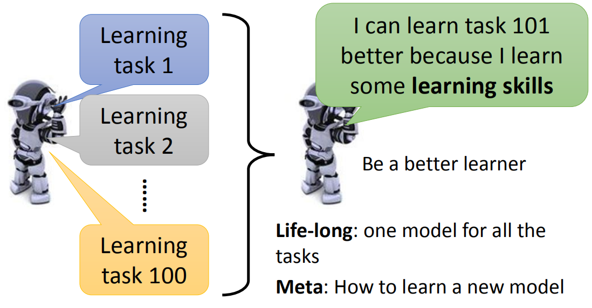

目的是学会去学习，从之前学习的任务中学会如何去学习一个新任务。对于Life-long任务，是学习一个模型能够完成不同的任务，但是元学习对于不同的任务有不同的模型，只不过可以从之前学习中获得经验，让模型在学习新任务时更快更好。

### Data

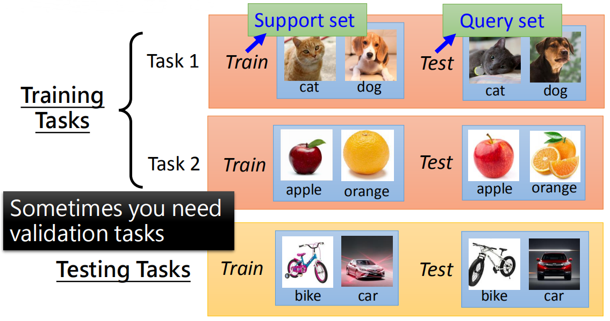

元学习的数据分为训练任务和测试任务，每个任务又有训练数据（support set）和测试数据（query set）。

### Aim

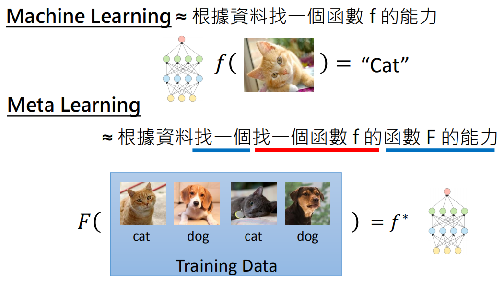

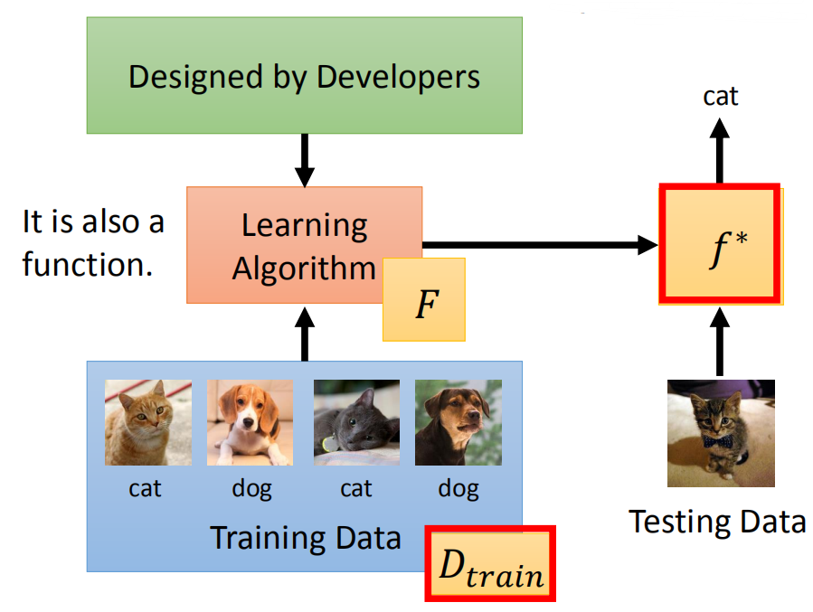

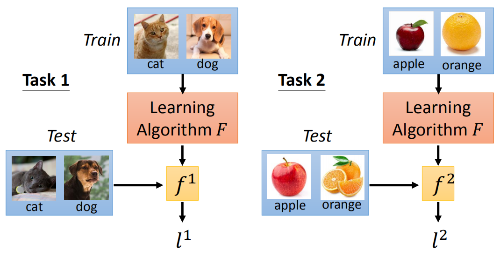

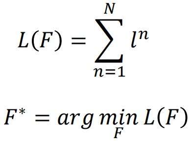

对于机器学习，目的是学习x到y的一个映射f，而f的结构、初始化参数、参数更新方法等是人为定义的；而元学习的目的是使用训练任务学习一个F，它会输出一个f用于更好地学习新的任务。

## MAML

Chelsea Finn, Pieter Abbeel, and Sergey Levine, “Model-Agnostic Meta-Learning for Fast Adaptation of Deep Networks”, ICML, 2017

MAML是最先提出元学习的论文，在这篇论文中，元学习用于学习初始化参数，也就是用训练任务训练模型，得到模型参数，之后用于初始化新任务的模型参数。此时，要求不同任务的模型结构是一致的，但这并不是元学习的要求，比如有的元学习是为了学习一种参数更新的方法，这种情况就不要求模型结构相同。

### 损失函数

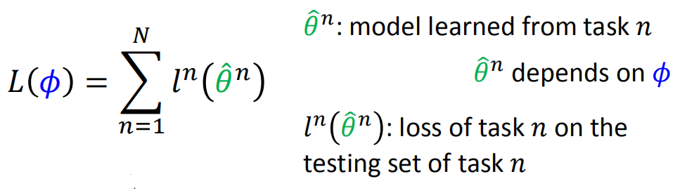

首先使用原始参数针对某个任务训练一次，得到新的参数，然后使用新的参数的损失优化原始参数。

### MAML vs Model Pre-training

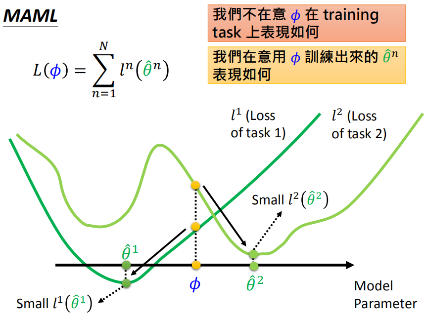

MAML并不在意原始参数在训练任务上的表现如何，在意的是在原始参数上训练出来的参数表现如何。比如图中原始参数对于两个任务的效果并不好，但是只需要在两个任务上经过简单训练即可得到效果很好的模型（注意：针对不同任务得到的模型是独立的）。关注的是模型的潜力。

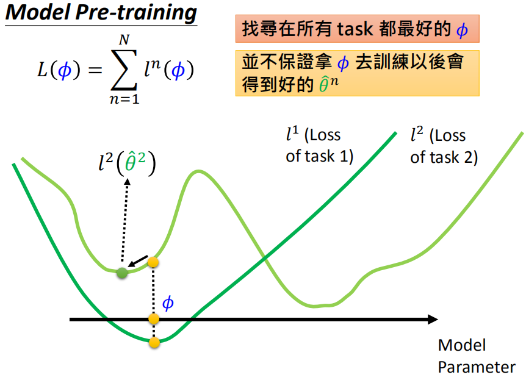

模型预训练的目的是找到在所有任务上都很好的原始参数，但并不保证使用原始参数针对不同任务训练后能够得到好的模型。比如图中的原始参数对于所有任务表现都不错，但是针对任务2训练后得到的模型并不好。关注的是模型现在的表现如何。

### Update

在训练时，针对每个训练任务，一般只考虑一步训练之后的结果：

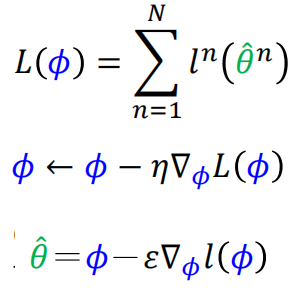

这样的**优点**：

1）训练比较快

2）我们希望模型只需要针对不同的任务训练一次就能够达到很好的效果，不过这只是我们的愿望，在训练的时候这样去训练，但是在真正测试使用的时候，可以针对新的任务按需要训练多次

3）针对Few-shot学习，数据量比较少，训练次数多的话容易过拟合于训练任务

**梯度计算**：

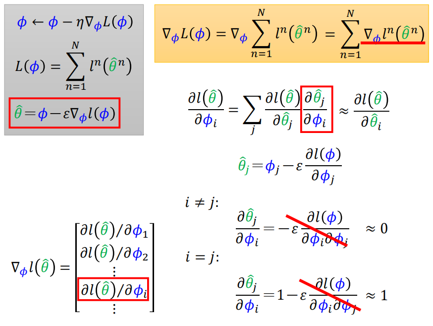

实际训练时应该针对某个任务训练两次，然后求导数来优化原始参数，这样需要求二阶导数，但是在论文中作者使用一阶导数来近似，也就是上图中直接使用第二次训练得到的导数来优化原始参数，结果为：

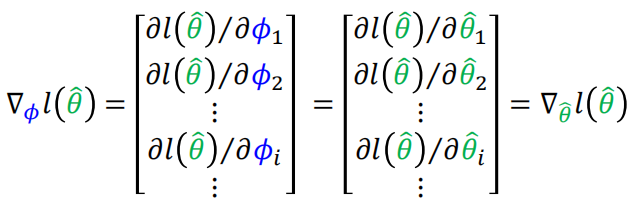

**实际实现过程**：

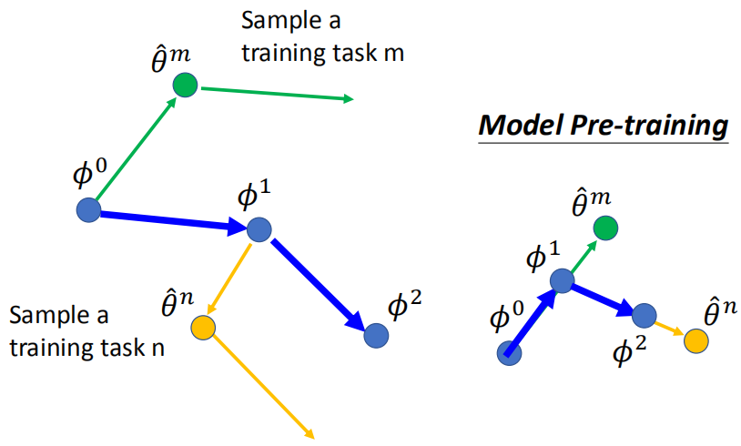

## Reptile

Alex Nichol, Joshua Achiam, John Schulman, On First-Order Meta-Learning Algorithms, arXiv, 2018

这篇论文在训练时不是考虑一步，而是考虑多步之后的结果，流程为：

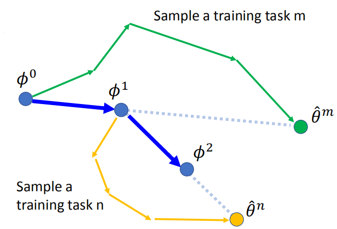

MAML vs Reptile vs Model Pre-training:

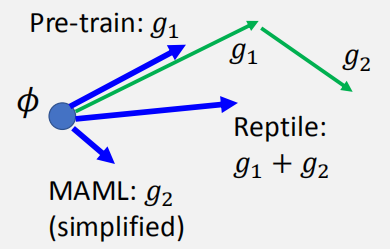
