一、Compare and Reweight: Distinctive Image Captioning Using Similar Images Sets, ECCV2020 oral
-----------------------------------------------------------------------------------------------
> [自制PPT](https://github.com/ezeli/notes_in_BIT/raw/master/PPT/ECCV2020%20oral%20Compare%20and%20Reweight%20Distinctive%20Image%20Captioning%20Using%20Similar%20Images%20Sets.pptx)

### 1、解决问题

1）现在的方法生成的句子可以准确的描述图片，但是对于相似的图片，生成的句子是通用的，缺乏独特性。如下图所示，CIDErBtw是作者提出的一种衡量描述独特性的指标，值越小表示越独特，对于两个相似的图片，人们标注的描述具有很好的独特性，但是baseline模型生成的描述就是相同的，而作者的方法生成的描述则具有不错的独特性。
<!-- more -->
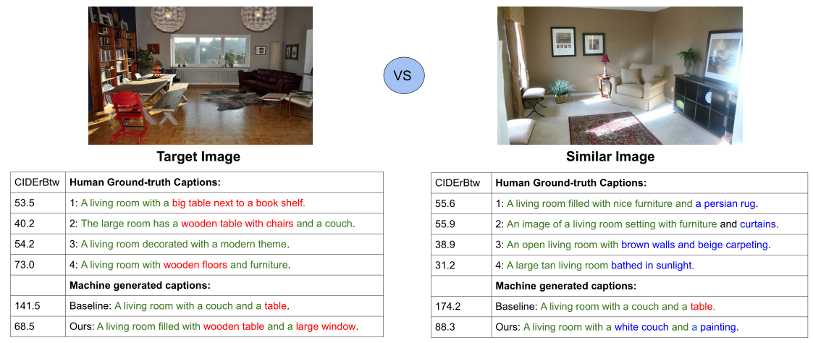

2）之前的有方法利用图像检索来优化模型，其目的是使生成的描述远离训练批次中的其他图像。一方面，图像检索鼓励模型生成独特的单词，另一方面，它会损害准确性和描述质量——图像检索上的权重过高可能会使模型重复生成独特的单词。

### 2、方法

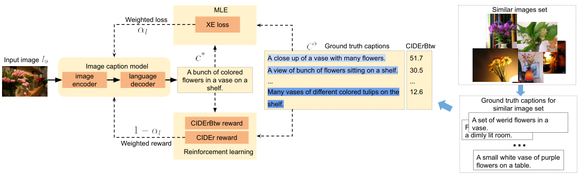

作者首先提出了一个新的描述独特性指标：CIDErBtw，之后基于该指标对现有的XE损失和CIDEr奖励进行加权改造（之前的方法会认为同一个图片的标注描述是等同的，现在会对它们分配不同的权重，CIDErBtw值越小权重越高），并且直接使用该指标作为一种新的奖励来优化模型。

#### 1）Similar images set

通过训练好的图文匹配模型VSE++为每种图片找到它的相似图片集，两个图片的相似度定义如下：

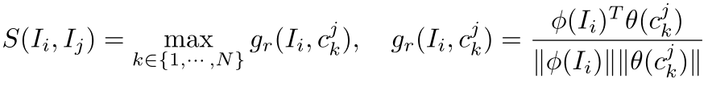

首先对某张图片和另一张图片的每个标注描述进行编码，之后计算他们的匹配度得分，最后取最大值来代表这两张图片的相似度。

#### 2）Between-set CIDEr (CIDErBtw)

##### （1）定义

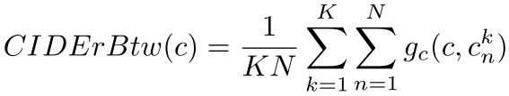

K表示相似图片的数目，N表示每张图标注描述的数目，计算了某个图片的一句描述c和其相似图片集的所有描述的CIDEr得分均值，值越小表示c越独特。

##### （2）训练策略

分为XE损失预训练和RL微调两个阶段。

首先根据CIDErBtw值计算权重：

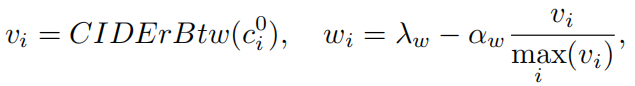

然后对XE损失和CIDEr奖励进行加权：

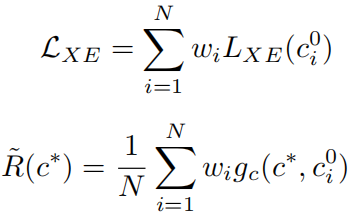

RL阶段也会直接采用CIDErBtw作为奖励的一部分，最后的RL奖励和损失为：

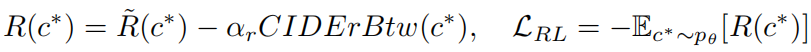

二、Length-Controllable Image Captioning, ECCV2020
--------------------------------------------------
> [自制PPT](https://github.com/ezeli/notes_in_BIT/raw/master/PPT/ECCV2020%20Length-Controllable%20Image%20Captioning.pptx)

### 1、解决问题

1）现有的大多数方法不能够控制生成的描述，例如选择粗略的还是详细的描述图片。

2）基于LSTM、Transformer的自回归模型的计算复杂度随着生成描述长度的增加而线性增加。

### 2、方法

1）使用简单的长度级别嵌入来使模型能够控制生成描述的长度。

2）设计了一种非自回归方法可以在长度无关的复杂性中生成描述。

效果如下：

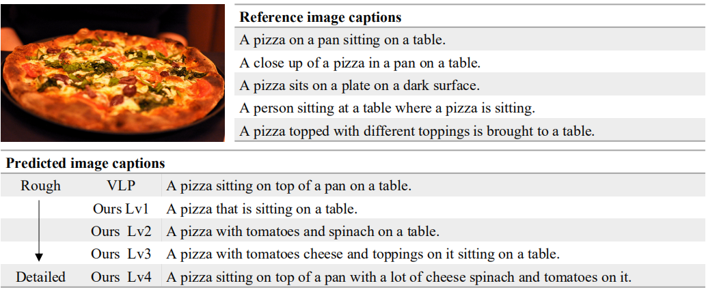

可以看出随着描述长度的增加，描述内容更加丰富，更加关注图片的细节。

#### 1）获取长度信息

首先根据描述的长度范围将数据分为4或者5个长度级别。

单词最终的向量表示如下：

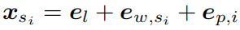

表示为长度级别的嵌入向量加单词的词嵌入向量加位置嵌入向量（可选的，用于基于Transformer的解码器）。

在训练的时候，长度级别根据ground
truth来判断，在推理的时候，长度级别人为指定，用于控制生成描述的长度。

**长度感知的自回归解码器：**

作者将长度级别嵌入整合到两个SOTA方法来进行实验：AoANet (基于LSTM的解码器) 和VLP (BERT类型的解码器)。只是将单词的嵌入表示替换为上述形式，无需进行任何其他修改。通过这种方式，解码器可以显式地对长度信息进行建模。

#### 2）非自回归的长度可控的解码

为了提高解码效率，作者提出了一种非自回归的长度可控的模型：LaBERT，如下图所示：

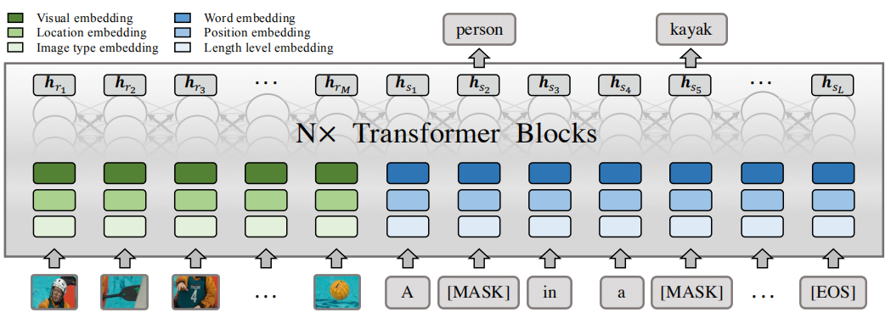

图片区域特征输入为：

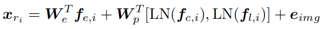

三个f分别表示物体的区域特征、分类概率和位置特征。eimg是一种可学习的嵌入，可将图像区域与文本标记区分开。

单词的嵌入表示同样是上述形式。

**训练**

首先根据描述长度确定它的长度级别，然后使用[EOS]将描述填充到该长度级别范围的最大长度，之后用[MASK]随机替换描述中的m个单词来构造输入序列S（m是从1到最大长度中随机选择的），最后模型根据输入的图片信息和序列S的信息来预测被替换掉的真实单词。

**推理**

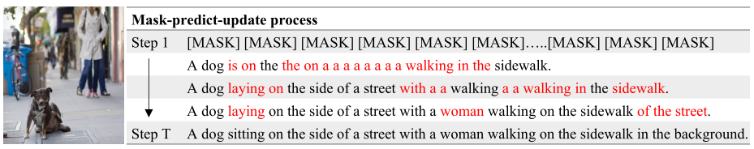

如上图所示，在最开始输入指定长度级别中最大长度的[MASK]序列，之后得到一个初始预测的句子以及每个单词对应的置信度（也就是该单词的输出概率）。为了鼓励模型预测更长的描述，作者建议在长度级别范围内将[EOS]的概率按系数衰减（该系数取值是一个小于1的数）：

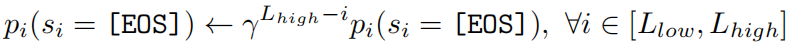

之后选择置信度最低的n个单词替换为[MASK]，再次进行解码，得到一个新的更好的句子，并且更新置信度：

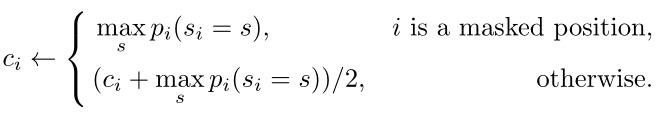

之后继续迭代更新句子和置信度指定次数，得到最终的描述。

n的计算：

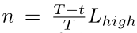

T表示迭代总次数，t表示当前迭代次数，随着迭代的进行，n越来越小。

非自回归的方法计算复杂度与T相关而和生成描述的长度无关，降低了生成长描述的计算复杂度，并且还能在之后的步骤中修改早期步骤中犯的错误，这在自回归的方法中是不可行的。
