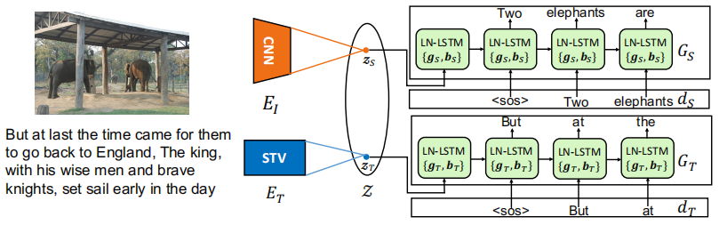
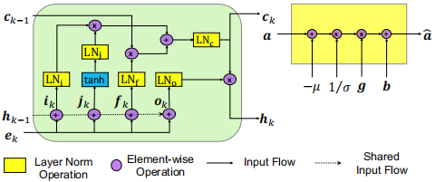
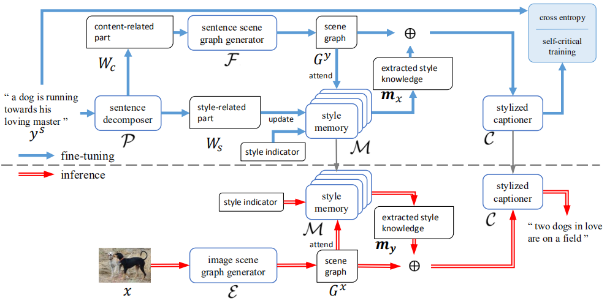
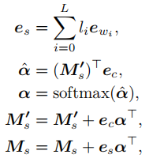
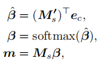
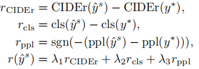

一、Unsupervised Stylish Image Description Generation via Domain Layer Norm, AAAI2019
-------------------------------------------------------------------------------------

作者提出了一种无监督风格化描述生成模型，能够以配对的无风格数据和没有配对的风格化语料进行训练，并且它使用户能够通过插入特定样式的参数来生成各种风格描述，灵活地将新的样式包含到现有模型中。论文将配对的无风格描述视为源域数据，将未配对的风格化语料视为目标域数据，最主要的贡献就是展示了只需要对layer normalization的参数进行调整就能从源域和目标域区分出语言风格，并将这种机制称为Domain Layer Normalization (DLN)，结构图如下：
<!-- more -->

ET使用Skip-Thought Vectors (STV)网络，GT和GS使用Layer Normalized Long Short Term Memory unit (LN-LSTM)网络。EI和ET将图片和风格化语料编码到一个共享的潜在空间Z，并使用GS和GT分别解码成无风格和风格化描述。为了确保潜在空间是共享的，GT和GS共享除了layer norm参数之外的所有参数，背后的直觉是鼓励共享权重来捕捉两个域之间的事实内容，而差异（即风格）则在layer norm参数中被捕获。通过监督信息（配对的无风格数据）训练EI和GS，通过风格化语料重构来训练ET和GT，LN-LSTM（左）和layer normalization操作（右）如下所示：

扩展一个新的风格：使用之前已经在源域和某一目标域上训练好的模型参数作为初始化参数，使用新的目标域数据进行微调，损失函数如下：

LS和LT是正常的MLE和重构损失，采用正则化项R来防止新的权重偏离预先训练的模型，这鼓励调整后的模型保持在之前训练学习到的信息。

二、MemCap: Memorizing Style Knowledge for Image Captioning, AAAI2020
---------------------------------------------------------------------

### 1、解决问题

之前的styled image captioning方法严重依赖于让语言模型来捕捉风格因子，在这篇论文里设计了一个记忆模块来来从风格化语料中挖掘风格知识，并且提出了一种句子分解的算法来将句子分为风格相关的部分和内容相关的部分。

### 2、方法

整个模型（MemCap）包括一个风格记忆模块、一个句子分解器、一个描述生成器、一个图片场景图生成器和一个句子场景图生成器，结构图如下：

#### 1）Stylized Sentence Decomposing

句子分解的主要思想：当通过一个在客观句子集上训练得到语言模型进行评估时，风格化语句将会得到比客观语句更高的困惑度（perplexity）。流程：首先使用客观句子集训练一个语言模型；之后，对于一个风格化句子，将它解析成依存关系树；最后，采用迭代的方式去除掉句子中和风格相关的部分，具体来说，迭代移除掉依存关系树上的结点和它的子树，然后使用语言模型评估剩下的句子看能否获取更低的困惑度，如果能则代表去除的部分是和风格相关的，进入下一次迭代，直到无法获取比目前困惑度更低的新句子，此时，剩下的就是和内容相关的部分，去除的就是和风格相关的部分。

#### 2）Scene Graph Generation

场景图能够用结构化的方式总结图片或句子的信息，包括图片和句子中的物体、物体间的关系和物体的属性。对于句子来说，首先解析为依存关系树，之间使用基于规则的方法将它映射成场景图，对于风格化句子，首先进行分解，然后使用内容相关的部分生成场景图。对于图片来说，首先生成图片的事实描述（使用训练好的Up-Down模型来生成），然后在转化为场景图。

#### 3）Style Memory Module

对于每种风格都含有一个包含风格相关知识的矩阵和一个包含事实内容的矩阵。在训练阶段，首先将风格化句子分解，然后将每个单词表示成嵌入向量，然后通过如下方式进行更新：

ew表示每个单词的嵌入表示，es表示风格相关的所有单词的嵌入表示（分解后风格相关的单词的标签l=1，内容相关的单词l=0），ec表示场景图的嵌入表示（通过对物体之间的和物体和属性之间的关系处理得到的上下文相关的表示），Ms’表示事实内容知识矩阵，Ms表示风格知识矩阵，通过计算得到的权重来更新两个矩阵。当提取风格知识时，和更新的操作类似：

#### 4）Memory Based Stylized Captioner

通过一个两层LSTM模型实现：场景图的嵌入表示向量作为attention LSTM的输入，然后注意力加权的结果作为language LSTM的输入，最后生成风格化描述。其中提取出的风格知识m被用于初始化两层LSTM的cell state。

#### 5）训练

预训练：使用交叉熵损失函数在图片-客观描述数据集上进行预训练，将图片转化为场景图作为描述生成器的输入，由于客观描述中无法获取风格知识，所以将m设为零向量。

微调；使用风格化语料对记忆模块和描述生成器进行训练，整体过程如上图所示。在前几个迭代周期采用交叉熵损失训练，之后采用强化学习方式，其中奖励函数包含CIDEr奖励（根据ground-truth进行训练，使模型生成的描述保留图片的内容信息）、风格分类奖励（提前训练一个风格分类器）、困惑度奖励（使用风格化语料提前训练一个语言模型），公式如下：

