一、Say As You Wish: Fine-grained Control of Image Caption Generation with Abstract Scene Graphs, CVPR2020
----------------------------------------------------------------------------------------------------------

### 1、解决问题

现有的方法无法根据用户的意图细粒度的控制生成的描述，比如控制以什么层次的细节程度来描述图片中的物体、以及那些属性和关系应该包含在描述中等等。只存在一些粗粒度的控制，比如控制描述的风格、描述哪个物体、描述图片那个区域等。
<!-- more -->
### 2、方法

作者提出一种细粒度的控制信号：Abstract Scene Graph (ASG)，可以表达用户不同的意图。ASG中包括三种抽象的结点：物体、属性和关系，但是它们没有具体的语义标签，因此，这种结构很容易手动或自动获得，因为它不需要语义识别。并且为了生成指定的ASG的描述，作者提出一个基于编解码框架的ASG2Caption模型，解决了三个主要的问题：1、它的场景图编码器是角色感知的，也就是能区分节点的角色（因为ASG中的结点没有语义标签，所以需要这种能力），并用场景图上下文增强每个节点的语义表示；2、不但能通过ASG中的结点控制生成描述的内容，还能通过结点的连接控制描述的顺序；3、为了全面覆盖ASG的信息，模型在解码时逐渐更新图的表示以持续追踪图的访问状态。

ASG2Caption模型结构图：

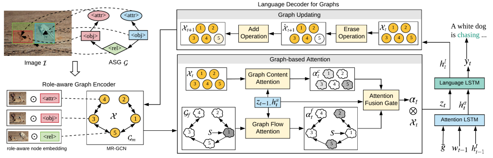

#### 1）Abstract Scene Graph

如结构图的左上方所示，用户可以通过定制ASG来表达意图：1、加入图片中感兴趣的物体的边界框；2、通过添加物体的属性来控制描述细节；3、通过添加关系结点生成描述物体间关系的句子。所以用户可以通过控制物体、属性、关系来细粒度的控制生成的描述。

除了从用户获得ASG，还可以更容易地基于现成的object proposal网络和关系分类器自动生成ASG，并且由于ASG中的结点不需要语义标签，所以不依赖于额外训练好的物体/属性/关系检测器。

因此，可以提取不同的ASG来捕获图像中的不同方面，从而生成不同的描述。

#### 2）ASG2Caption模型

**角色感知的图编码器：**

ASG中物体的特征是由边界框提取的，属性的特征和它所属的物体一样，关系的特征是由两个物体的联合边界框提取的，之后通过三个角色嵌入矩阵将节点的特征表示转化成角色感知的嵌入表示。虽然边是单向的，但是两个节点之间的影响是共有的，此外两种角色之间的消息传递和反方向是不一样的，所以作者设计了多关系图卷积网络（MR-GCN）用来扩展ASG的表示，其中包括6种关系（每两种节点之间有两种关系），对于每个节点，使用如下公式进行编码：

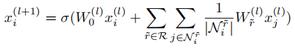

**图的语言解码器：**

包括一种基于图的注意机制，它同时考虑图的语义和结构，以及一种保持已描述或未描述的内容记录的图更新机制。基于图的注意机制分为两条线分别关注图的内容和结构（顺序），最后进行融合。通过图更新机制以保存每个解码步骤中不同节点的访问状态记录。

二、Better Captioning with Sequence-Level Exploration, CVPR2020
---------------------------------------------------------------
> [自制PPT](https://github.com/ezeli/notes_in_BIT/raw/master/PPT/CVPR2020%20Better%20Captioning%20with%20Sequence-Level%20Exploration.pptx)

### 1、解决问题

之前的模型训练方法分为两种：单词级别的交叉熵（XE）损失以及序列级别学习（SSL，也就是强化学习方式）。对于SSL，只是提高了模型生成描述的精确度，也就是CIDEr、METEOR、SPICE等指标的得分，但是却忽略了描述的召回率，也就是模型对于一张图片采样得到的描述都是类似的，并不具有多样性。在这篇论文中，作者首先通过理论和实践角度展示了当前SSL的限制，之后为SSL加入了一个序列级别的探索项用于提高召回率。

### 2、当前SSL的限制

#### 1）从理论角度

假设所有可能的句子集合表示为$\Upsilon$，某个输入（图片/视频）的标注描述（ground truth）集合表示为Y，通过模型采样得到的预测描述集合表示为$\tilde{Y}$，则精确度定义为：

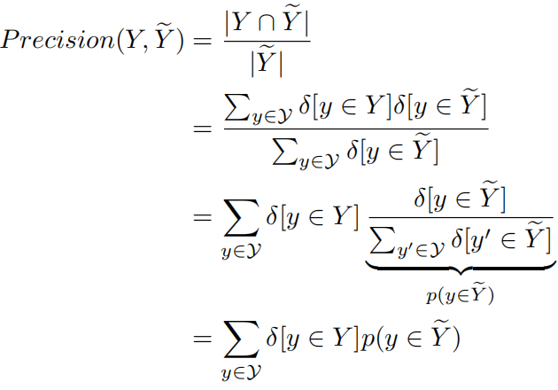

精度定义：预测出的句子中有多少在ground truth中。其中包括两项：$\delta\lbrack y \in Y\rbrack$指示y是否属于Y，$p(y \in \tilde{Y})$表示y属于$\tilde{Y}$的概率。之后，作者将第一项由二值函数（0-1函数）放宽为实值函数，输出为区间：[0, 1]，表示y属于Y的可能性：

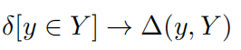

由于现在所有的评价指标都是有界的，所以可以使用最大值进行归一化，然后用于该实值函数。

由于$\delta\lbrack y \in \tilde{Y}\rbrack$只能是0和1，因此$p(y \in \tilde{Y})$只能取0和$\frac{1}{|\tilde{Y}|}$，如果同样将$\delta\lbrack y \in \tilde{Y}\rbrack$放宽为实值函数，那么$p(y \in \tilde{Y})$就能覆盖0到1整个概率区间，此时p实际上表示模型生成y的概率：

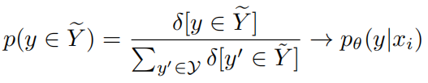

精确度的两项都进行放宽后，可以得到一个广义精确度（GP）：

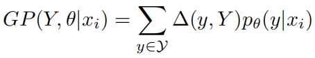

之后，将$(y,Y)$作为奖励，使用GP重写原始的SSL目标：

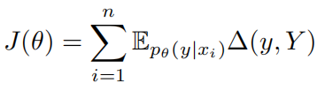

通过比较上面两个式子可以看出它们实质上是一样的：

这意味着SSL目标只优化了模型预测描述的精确度而忽略了召回率，但是对于一个输入应该存在多个正确的描述输出，这表明在训练模型时召回率也应该被考虑。

#### 2）从实践角度

精确度可以用CIDEr、METEOR、SPICE等指标进行测量，对于召回率，定义如下：

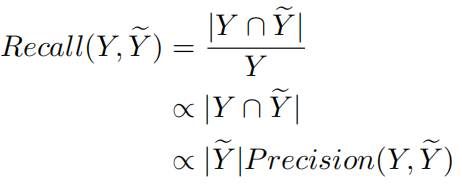

召回率定义：ground truth中有多少句子被生成了。目的是比较相同精确度时召回率的大小，因此可以通过比较模型预测的描述集的大小来测量召回率。但是，如果使用模型进行无限采样，得到的预测描述集的大小是没有意义的，因为它可以是无穷大，因此作者提出了一种有意义的方式：采样固定的次数，然后计算采样得到的描述之间的差异，差异越大表示越多样，即召回率越高。为了计算描述之间的差异，作者采用以下三种指标：

Div-1：表示$\tilde{Y}$中唯一的单元组的数量和$\tilde{Y}$中所有单词数量的比例，得分越高越多样；

Div-2：表示$\tilde{Y}$中唯一的双元组的数量和$\tilde{Y}$中所有单词数量的比例，得分越高越多样；

mBleu：表示$\tilde{Y}$中每个描述和其他剩余描述计算得到的Bleu得分，之后求均值，得分越低越多样。

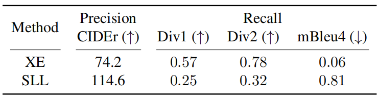

如上表所示，和XE相比，SLL训练得到的模型的精确度会提高，但是召回率会降低，也就是说对于一个输入，模型倾向于生成类似的描述。一个例子如下：

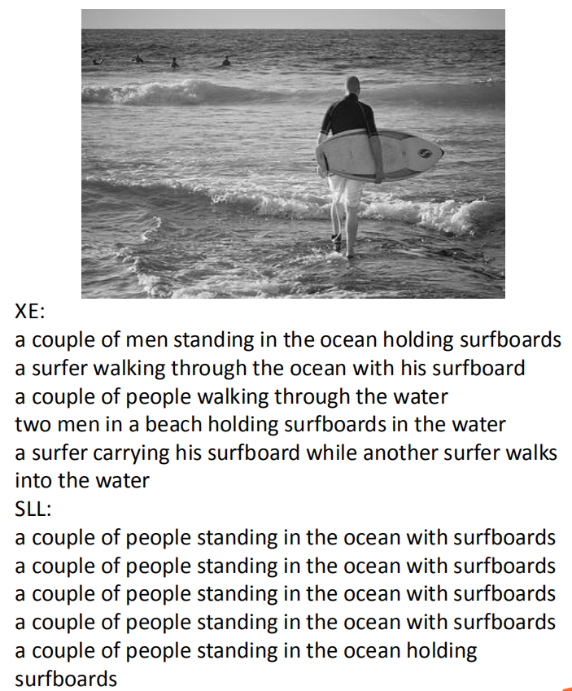

如下图所示，将描述投影到一维空间，发现语义一致的空间远大于通过SLL学到的模型采样的空间，其中y点就是正确但是不太可能被采样的点：

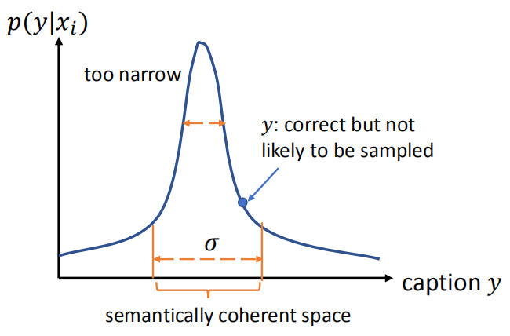

### 3、方法

之前的部分表明召回率可以使用多样性来代理测量，因此作者在原始的SSL目标中加入了一个多样性项来同时从精确度和召回率两个角度优化模型：

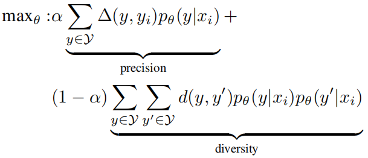

其中，xi是输入，yi是标注的真实描述，y和y’是模型任意采样得到的两个描述。$(y,y_{i})$测量y和yi的语义一致性，可以使用评估指标来计算。$d(y,y')$测量y和y’的句法差异，可以使用编辑距离或Bleu3/4来计算。

之后将它表示为最小化损失函数的形式：

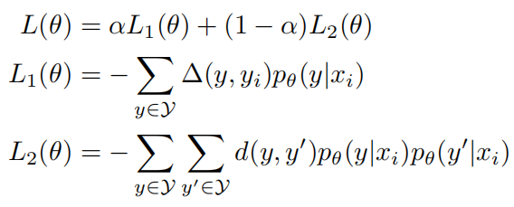

其中L1的梯度计算过程表示为：

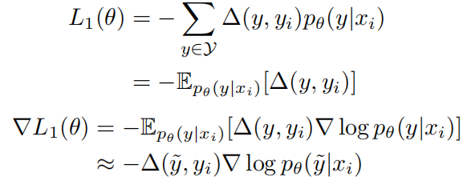

L2的梯度计算过程为：

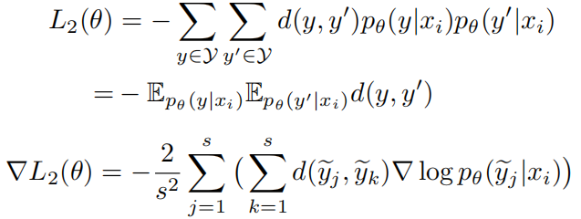

其中$\tilde{y_{i}}$表示为有模型采样得到的描述，s表示总共采样的个数。

最终定义的损失函数为：

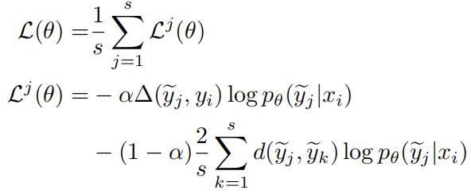
