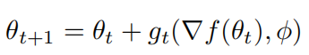
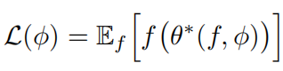
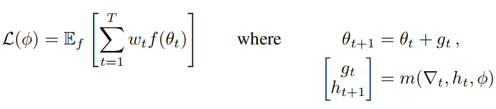
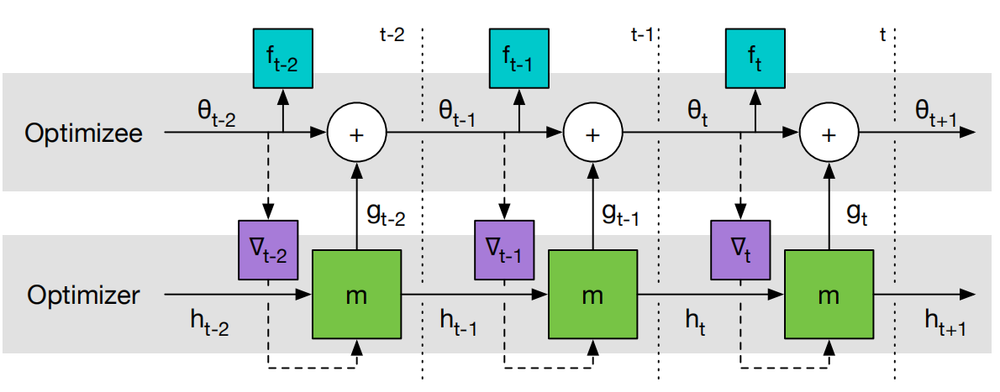
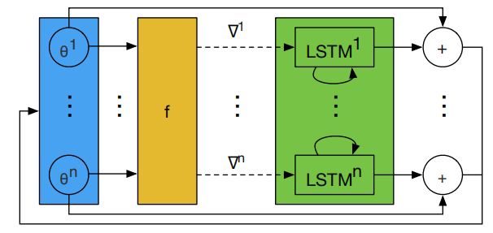
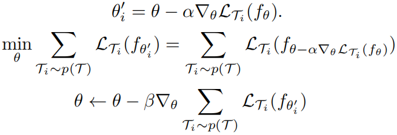
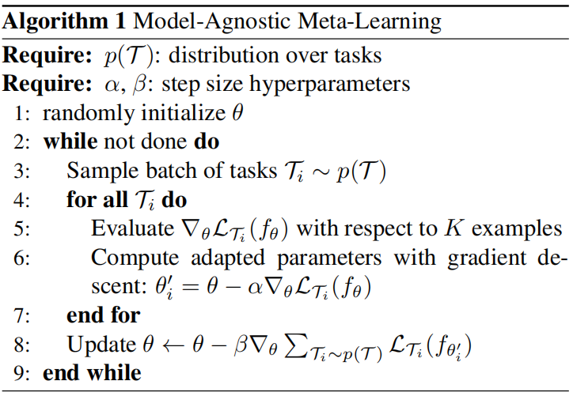

一、Learning to learn by gradient descent by gradient descent, NIPS2016
-----------------------------------------------------------------------

### 1、解决问题

在机器学习中，学习得到的特征取代了手工设计的特征，并取得了巨大的成功。但是，优化算法依然是手工设计的，针对不同的任务需要设计不同的更新规则，比如深度学习中常用的momentum、RMSprop、ADAM等。这篇论文中，作者将优化算法参数化，使用LSTM来作为优化器，通过学习的方式得到更新规则，也就是论文题目：通过梯度下降来学习如何通过梯度下降学习。这样就不需要针对不同的任务设计不同的优化算法，而只需要让LSTM优化器自己学习如何优化模型的参数即可。
<!-- more -->
### 2、方法

定义优化器optimizer的参数为 phi，被优化模型optimizee的参数为 theta，损失函数为f，则optimizee参数更新规则为：

gt就表示参数化的optimizer，表现和传统的ADAM等优化器是一致的，以optimizee的梯度为输入，输出为optimizee参数的更新值。而训练optimizer的损失函数定义为：

也就是取optimizee的参数为最优值 theta\*，然后将它的损失反馈给optimizer来进行训练，但是这只依赖于optimizee最后训练的参数，论文中对它进行了扩展，不光考虑最后训练的最优值，而且还要考虑整个训练过程的损失：

可以看出当wt=1，t=T时这个式子和上面的式子是相等的。此时可以采样不同的f，也就是通过不同的任务来训练这个优化器。整个流程也可以表示为下图：

在这个过程中，首先固定optimizer参数，然后不断更新optimizee参数，最后使用所有时间步的损失f求和来更新optimizer。注意在更新optimizer时，梯度只沿着实线方向传递，虚线方向的梯度被删除，也就是假设optimizee的梯度不依赖于optimizer的参数，这样避免了计算f的二阶导数。

上述方法的一个问题就是LSTM优化器的输入（也就是optimizee参数的梯度）有至少上万的参数，这需要很大的隐藏状态维度，使得LSTM有大量的参数，不能够很好的训练。所以作者提出coordinatewise network architecture，每次只输入单个参数梯度，并输出对应的更新值，然后所有的参数共享LSTM参数，但是使用独立的隐藏状态，如下图所示：

这和Adam等优化器的思路一致，也就是对所有参数的更新规则是一样的，使得LSTM优化器可以是一个很小的网络结构，并且对输入的模型参数的顺序具有不变性。

并且LSTM优化器的结构使得它学到的动态的学习规则可以向momentum一样集成梯度历史中的信息。

在实践中，可以设置LSTM的输入和输出为一个合适的常数（在所有的时间步和所有的f中共享），这样就可以学到一个适用于所有f的一个优化器，并且此时也不要求所有任务的模型结构一致。

二、Model-Agnostic Meta-Learning for Fast Adaptation of Deep Networks, ICML2017
-------------------------------------------------------------------------------

### 1、解决问题

快速学习是人类智力的标志，我们能从几个样例中识别物体，也能通过几分钟就快速学习到新技能。我们希望AI也能做到这样，但是这种快速和灵活的学习是具有挑战性的，因为AI必须将其先验知识与少量的新信息集成在一起，同时避免对新数据的过拟合。在这项工作中，作者提出了一个元学习算法，它是通用的以及模型、任务无关的，因为它可以直接应用于任何用梯度下降训练的学习问题和模型。关键想法就是通过大量不同的任务训练模型的初始化参数，然后通过在少量新数据上更新一次或者几次后就能在新任务上达到很好的效果。该方法可以应用到任何的模型结构上，但是选好某个模型结构后，所选取的所有任务（包括训练任务和测试任务）的模型都只能是该结构，因为该方法的目的就是训练模型的初始化参数，如果新任务使用的模型结构不同，那么学出来的初始化参数就没法用。但这不是元学习的要求，比如如果某个元学习的目的是为了学习一种优化规则（上一篇论文），则训练时不同任务就可以使用不同的模型结构。

### 2、方法

Model-Agnostic Meta-Learning（MAML），目标是能够找到对任务变化敏感的模型参数，这样参数的微小变化将对任何任务的损失函数产生很大的改进。模型更新过程如下：

也就是针对不同的训练任务先训练一次，然后使用该任务对应的测试数据计算损失和梯度用来优化原始参数，流程为：

以上过程涉及到求二阶导数，作者使用一阶导数来近似，也就是直接用第二次计算出的梯度更新原始参数。
