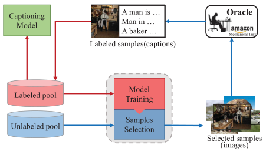
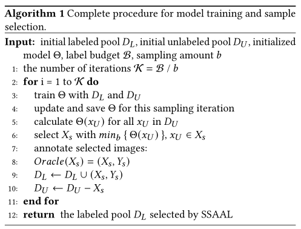
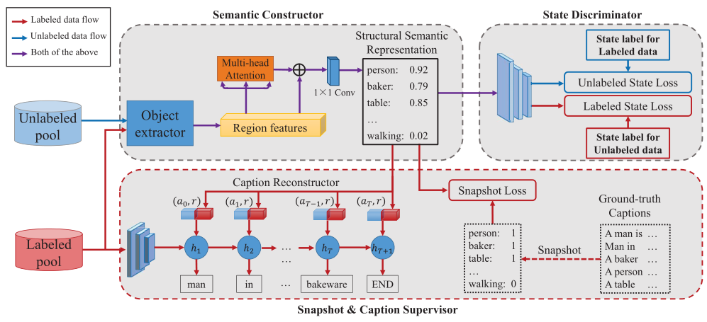
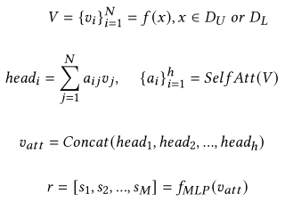

一、Structural Semantic Adversarial Active Learning for Image Captioning, ACMMM2020 oral
----------------------------------------------------------------------------------------
> [自制PPT](https://github.com/ezeli/notes_in_BIT/raw/master/PPT/ACMMM2020%20oral%20Structural%20Semantic%20Adversarial%20Active%20Learning%20for%20Image%20Captioning.pptx)

### 1、解决问题

标注图片描述的成本非常高。

### 2、方法

#### 1）Active learning

引入主动学习（Active learning）方法来从未标注的图片集中选取最具代表性的图片来进行标注，再用于训练captioning模型。
<!-- more -->

流程：在第一次采样的时候随机从未标注池中选取一部分数据进行标注，然后使用已标注和未标注的数据训练AL模型来区分最具代表性的数据，之后模型迭代选择固定数量的代表性样本进行标注，直到标注预算用完为止。

#### 2）SSAAL model

作者提出的AL模型，结构如下：

主要包括语义构造器、Snapshot&Caption监督器和状态判别器三部分。

**（1）语义构造器**

首先构造一个结构性词汇表（大小为M），选取出现频率高的可以描述视觉内容的单词（物体、属性和关系词）；然后将提取出来的图片区域特征通过多头注意力机制映射为结构语义表示（一个M维的向量，分别对应于词汇表的每个单词），计算公式如下：

**（2）Snapshot&Caption监督器**

Snapshot&Caption监督器仅使用已标记的数据来有监督的训练语义构造器。

Snapshot监督器提供单词级别的监督，Snapshot是一个M维的二值向量，对应于词汇表，用于表示图片标注描述中是否存在对应的单词。使用MSE损失进行训练。

Caption监督器提供句子级别的监督，将结构语义表示重构为图片标注描述。

**（3）状态判别器**

状态判别器用于区分已标记（状态标注为1）和未标记（状态标注为0）图片的结构语义表示，和语义构造器以对抗的方式进行训练，使结构语义表示更加可识别，并且样本选择更加有效。

在采样阶段，使用语义构造器为未标注的图片生成语义表示，然后通过状态判别器预测其状态得分，选择前K个样本进行标注。
