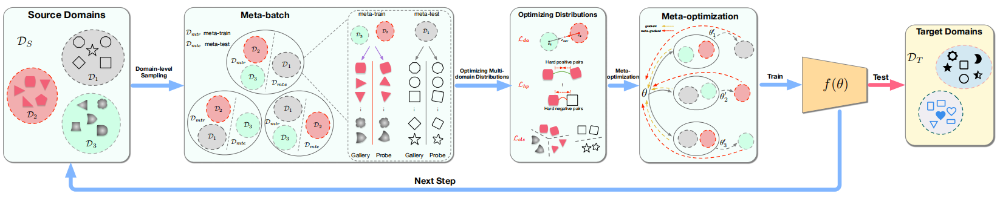

一、Meta Learning for Image Captioning, AAAI2019
------------------------------------------------
> [自制PPT](https://github.com/ezeli/notes_in_BIT/raw/master/PPT/AAAI2019%20Meta%20Learning%20for%20Image%20Captioning.pptx)

### 1、解决问题

使用强化学习训练模型，可能会使模型与奖励函数过拟合，造成奖励黑客行为（reward hacking），也就是说虽然奖励函数的得分提高了但是模型的实际性能是降低的，这是因为奖励函数不能非常正确的表达出生成描述的质量，一些错误的表示可能反而有很高的奖励，尤其是对描述的命题内容和独特性的奖励。比如，使用CIDEr优化倾向于让句子以“介词+a”结尾，因为CIDEr评价指标会惩罚太短的句子并给常见的短语小的权重，因此，当模型生成短描述时RL会添加一些小权重但是常见的短语来避免惩罚。SPICE指标认为不正常结尾是不匹配的对象-关系对，会惩罚这种现象，但是，SPICE有自己的奖励黑客问题，因为它不惩罚场景图中的重复元组。从技术上讲，很难设计一个完美的评价指标，能够考虑到预期目标的每一个方面。
<!-- more -->
### 2、方法

这篇论文使用元学习（meta learning）的方法，利用来自ground truth的监督信息，在优化评价指标的同时确保生成描述的命题正确性和独特性。具体来说，作者将MLE优化和RL优化看做两个任务，建立一个元模型同时适应这两个任务，找到这两个任务的最优解。如下图所示，如果直接将这两个任务的损失加起来（棕色箭头，表示为MLE+RL），梯度方向在它俩之间，这并不能保证是任何一个任务的最优解，但是使用元学习（绿色箭头）能够使学到的模型参数同时适应两个任务。

在实验时，模型先进行MLE预训练，然后在使用元学习对MLE和RL两个任务进行微调。注意作者对MLE进行了改进，即最大化正对（配对的ground truth）的概率同时最小化负对（不配对的ground truth）的概率，对于RL作者采用了CIDEr+SPICE作为奖励函数。

二、Learning Meta Face Recognition in Unseen Domains, CVPR2020 oral
-------------------------------------------------------------------
> [自制PPT](https://github.com/ezeli/notes_in_BIT/raw/master/PPT/CVPR2020%20Learning%20Meta%20Face%20Recognition%20in%20Unseen%20Domains.pptx)

### 1、解决问题

在人脸识别的实际应用中，在源域上训练好的模型常常被部署到具有不同分布的另一个目标域上，此时有两种场景：1）目标域是已知的并且数据可以访问，则称为人脸识别的域适应任务，常见的设置是源域包含带有标注的人脸数据，目标域带或者不带标注，此时主要将从源域中学到的知识迁移到目标域以提高模型在目标域的泛化性；2）目标域是不可见的，被视为人脸识别的域泛化任务，作者称为Generalized Face Recognition（GFR），这种情况更常见，因为训练好的模型常常被部署到一个未知的场景中，会遇到很多没有见过的数据。很明显，GFR要更困难，并且已有的域泛化任务往往假设源域和目标域共享标签空间，但是GFR源域和目标域的标签空间是不相交的。作者提出了Meta Face Recognition (MFR)方法用于解决GFR任务，首先采用域级采样策略将源域分为meta-train域和met-test域来模拟域偏移，之后通过三种损失来计算梯度，并且将来自meta-train域的梯度和来自meta-test域的元梯度（meta-gradients）通过meta-optimization整合，并用于更新模型以提高模型的泛化性。并且和传统的元学习方法相比，MFR不需要在目标域上进行模型更新，可以直接处理不可见的域数据。

### 2、方法

MFR包括三个部分：域级采样策略；优化多域分布的三个损失，以学习域不变性和可区分的人脸表示；元优化过程来提高模型泛化性。模型结构图如下：

在训练阶段，可以访问多个源域数据，每个源域数据都包含自己的标签集合；在测试阶段，模型在一个或几个之前不可见的目标域上进行评估，并且不进行模型更新。

#### 1）域级采样

在每次训练迭代中，作者将N个源域划分为N-1个meta-train域和1个meta-test目标域来模拟域偏移，通过这种方式，鼓励模型能够很好的泛化到不可见的目标域上。构建一个meta-batch的具体流程为：在N个源域上进行迭代，每次迭代的源域选做meta-test域，剩下的源域都作为meta-train域，之后分别在meta-train域和meta-test域上选取B个实体，并为每个实体选择两个人脸图片，一个作为gallery，另一个作为probe。然后，模型由每个meta-batch的累积梯度进行更新。

#### 2）优化多域分布

优化多域分布是为了让相同的实体映射到相近的表示，而不同的实体被映射的表示之间可以区分。作者通过三个损失来优化和学习域不变性和可区分的表示：

**Hard-pair Attention Loss**：用于优化hard正对和负对的局部分布。首先将采样得到的B对实体转化为嵌入表示：

之后对嵌入表示进行l2归一化后计算一个相似性矩阵：

然后使用一个正阈值和一个负阈值来过滤得到hard正对和负对：

最后的损失为：

**Soft-classification Loss**：通过分类考虑了批次内的全局分布：

其中W初始化为：

并且W中的每一行执行l2归一化。

**Domain Alignment Loss**：用于对齐域中心。作者发现跨meta-train域的负对比域内的负对更容易区分，所以通过添加域对齐正则来使嵌入具有域不变性，以减小不同meta-train域的domain gap。为了执行域对齐，作者使多个meta-train域的平均嵌入表示彼此靠近。损失计算过程如下：

#### 3）元优化

整个元优化流程如上图所示。

首先在meta-train域上训练模型：

然后在meta-test域上测试模型：

最后，同时优化上述两个损失：

最后整个算法流程可以表示为：

