一、Normalized and Geometry-Aware Self-Attention Network for Image Captioning, CVPR2020
---------------------------------------------------------------------------------------
> [自制PPT](https://github.com/ezeli/notes_in_BIT/raw/master/PPT/CVPR2020%20Normalized%20and%20Geometry-Aware%20Self-Attention%20Network%20for%20Image%20Captioning.pptx)

### 1、解决问题

随着Transformer在NLP领域的流行，它的self-attention（SA）的思想也逐渐被引入到image captioning领域。但是原始的SA有两个问题：

1）Internal Covariate Shift（ICS）问题：在训练过程中，由于网络参数的变化，当query的分布发生变化时，该层的输出的分布会发生变化，也就是说，随后的层必须不断适应新的输入分布，因此，SA可能无法有效地学习。
<!-- more -->
2）无法建模输入元素之间的几何关系，但是图片中的物体之间是有几何关系的，并且这种内在的关系有利于对视觉信息进行推理，对理解图片内容有很大帮助。在NLP中，对于1维的句子来说，SA将元素在序列中的绝对位置的表示添加到输入的每个元素中来建模位置关系，但是这对于image captioning是不适用的，因为2维的几何关系很难通过绝对位置来推断。

为此，作者提出Normalized Self-Attention (NSA)和Geometry-aware Self-Attention (GSA)分别解决以上两个问题，并把它们组合起来构建NG-SAN代替self-attention网络的编码器中的原始的SA模块。

### 2、准备工作

Self-Attention流程：首先将输入X映射为query（Q）、key（K）和value（V），之后通过Q和K得到权重E，最后通过E对V进行加权求和得到上下文向量Z：

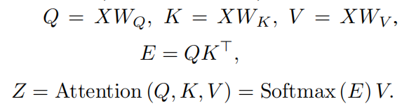

之后，作者介绍了Self-Attention Network（SAN），并作为这篇论文的基准结构，如下图所示：

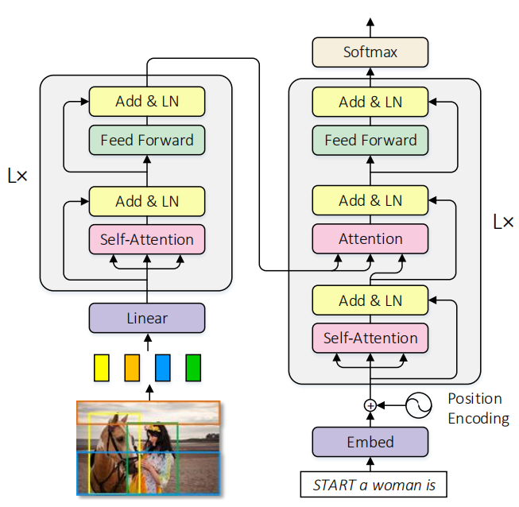

由于图像中的区域没有像序列一样的自然顺序，因此在编码器中没有添加位置信息。

### 3、模型

#### 1）Normalized SA (NSA)：

NSA为self-attention引入再参数化（reparameterization），利用标准化方法来改进模型训练。

再次回顾self-attention中注意力权重的计算：

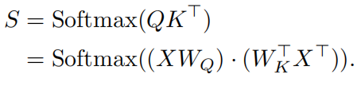

可以认为将X经过两次线性映射，然后在通过一个softmax层，因此上式可以重写为：

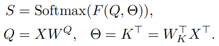

其中参数$\Theta$是基于X动态计算。从这个角度，SA会受到ICS问题的影响，也就是当输入Q的分布由于训练过程中网络参数的变化而发生变化时，下一层的参数$\Theta$需要不断适应新的输入分布，因此，SA可能无法有效地学习。所以，解决ICS问题，有利于Q的分布随时间推移而保持固定，这样$\Theta$就不需要为弥补Q分布的变化而进行调整。这可以通过在Q上执行标准化来实现。

此时，对Q执行批标准化（Batch Normalization）并不适用，因为参数$\Theta$并不是对于所有数据共享的，而是基于输入X动态计算得到的，因此，更可取的做法是对每个单独的实例执行标准化：

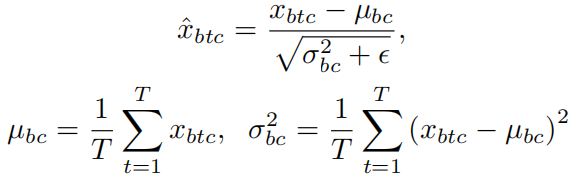

其中b表示一个批次中那个实例，t表示一个实例的那个区域特征，c表示一个区域特征的那个通道。将上述过程表示为实例标准化（Instance Normalization，IN），最后self-attention的再参数化表示为：

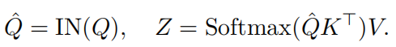

注意：IN和LN（层标准化，Layer Normalization）是不一样的，LN对每个元素的所有通道进行标准化，而IN对每个实例的所有输入元素的每个通道进行标准化。

#### 2）Geometry-Aware SA (GSA)：

将两个对象i和j之间的相对几何特征表示为$f_{i,j}^{g}$，这是包围盒相对位置和大小的四维向量：

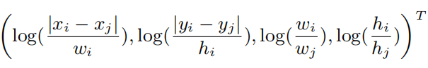

N个物体两两之间都包含一个相对几何特征，因此f的维度为N\*N\*4。之后，对原始SA中的注意力权重计算过程进行重写：

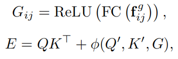

φ是几何注意力函数，输出一个N\*N的分数矩阵。Q’、K’是和G相同维度的query和key，和Q、K的计算方式相同。上式的第一项表示基于内容的权重，第二项表示几何偏差。下面介绍φ的三种选择，它们可以单独使用也可以组合使用：

内容无关的几何偏差：

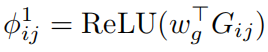

查询相关的几何偏差：

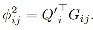

键相关的几何偏差：

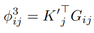

#### 3）NG-SAN

首先将GSA中的Q通过NSA中的方法进行标准化，然后使用这个模块代替编码器中原始的SA模块，这样就构成了NG-SAN模型。

二、Meshed-Memory Transformer for Image Captioning, CVPR2020
------------------------------------------------------------
> [自制PPT](https://github.com/ezeli/notes_in_BIT/raw/master/PPT/CVPR2020%20Meshed-Memory%20Transformer%20for%20Image%20Captioning.pptx)

作者主要就是将Transformer中的注意力机制加入到Image Captioning模型中，概览图为：

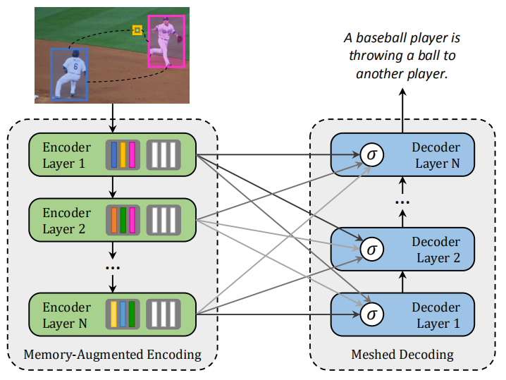

主要创新：封装了图像区域的多层编码器和生成输出句子的多层解码器，并且为了利用低层次和高层次的图像区域之间的关系，编码层和解码层以网状结构连接，通过可学习的门控机制进行加权。

#### 1、Meshed-Memory Transformer

分为编码器模块和解码器模块，它们都是注意力层的堆积。编码器负责找出输入图像的区域之间的关系，而解码器读取每个编码层的输出以逐字生成描述。

结构图为：

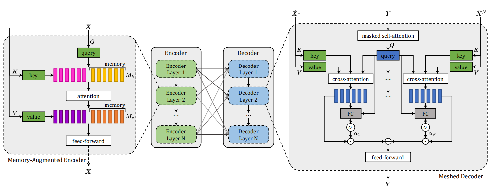

注意力操作为：

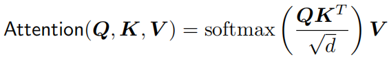

#### 2、Memory-Augmented Encoder

self-attention operation：

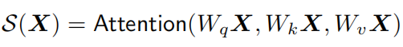

其中X表示提取出的一组图像区域特征。

问题：self-attention只关注输入集合两两之间的相似性，所以不能对图像区域之间的先验知识进行建模，比如给定“man”和“basketball”的区域编码特征，如果没有先验知识的话很难推断出“player”或者“game”的概念，同样，给定“eggs”和“toasts”的区域特征，可以很容易地利用关系的先验知识推断出图片是在描述“breakfast”的知识。

所以作者提出了**Memory-Augmented Attention**，对self-attention的key和value进行扩展，额外的“插槽”可以编码先验信息：

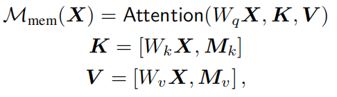

**Encoding layer:**

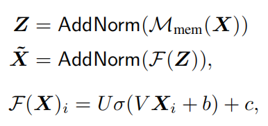

**Full encoder:**

将多个Encoding layer叠加起来，从多层次提取图像区域之间的关系。

#### 3、Meshed Decoder

为了在句子的生成过程中利用所有的编码层输出的多层次表示，编码层和解码层之间采用网状连接。

**Meshed Cross-Attention**

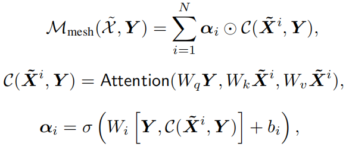

α中的权重既调节每个编码层的输出特征集合之间的贡献，也调节不同层之间的相对重要性。

**Architecture of decoding layers**

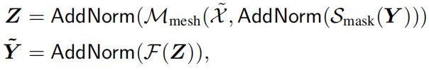

因为只依赖于前面已经生成的单词集合，所以采用了masked self-attention operation。
