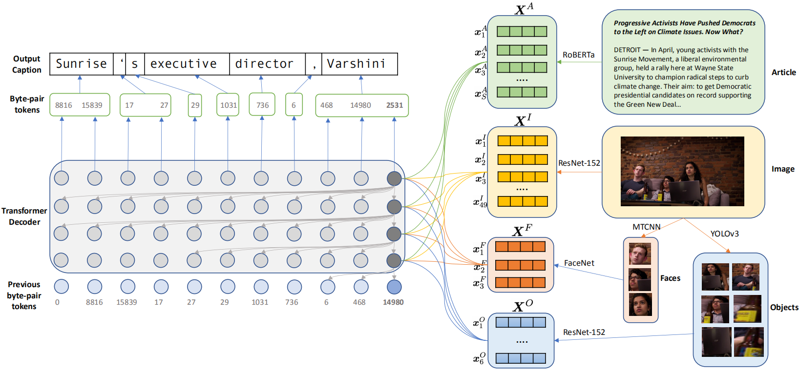
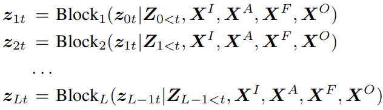
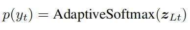
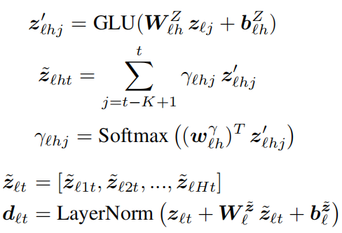
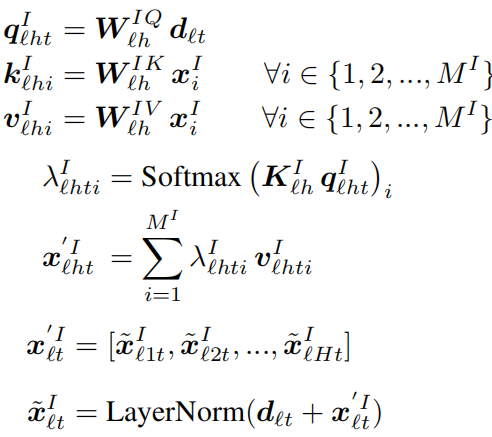
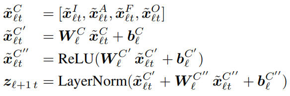

一、Transform and Tell: Entity-Aware News Image Captioning, CVPR2020
--------------------------------------------------------------------

### 1、解决问题

新闻中图片描述生成任务主要有两个挑战：一是依赖于现实世界的知识，特别是关于命名实体的知识；二是新闻中有丰富的语言描述，它们包括一些不常见的单词。作者通过一种多模态、多头注意机制将新闻中的单词与图像中的人脸和对象关联起来来解决第一个挑战，并且用Transformer语言模型来解决第二个挑战，该模型使用byte-pair-encoding（BPE）来编码单词：首先将单词表示为字母序列，之后使用贪婪算法合并公共字母序列，这样几乎所有的单词都可以用字母序列的组合来表示，这样就可以处理一些新的不常见的单词，而不需要使用一个特殊的未知标签代替。并且作者提出一个新的大型新闻图片描述数据集：NYTimes800k，包含445K文章和793K图片。
<!-- more -->
### 2、方法

如上图所示，首先使用四个经过预训练的编码器分别提取新闻文章特征、图片特征、图片中的人脸特征和物体特征，之后输入到解码器中生成描述。

对于解码器，每个Transformer块的输入输出表示为：

最后的概率输出为：

将词汇按照频率分为三个级别，并通过adaptive softmax代替传统的softmax操作，大大提高了计算效率。

每个Transformer块包含动态卷积和多头注意力两个模块：

**动态卷积**：用于代替self-attention，能够更加有效地关注过去已经生成的单词。给定核大小K和H个注意力头，该模块的公式表示为：

其中GLU是gated linear unit activation function。

**多头注意力**：以图片特征注意力模块为例，公式为：

对于新闻文章特征、图片中的人脸和物体特征执行相同的多头注意力操作，并将它们的结果进行连接并输入到一个前馈网络中得到最后的输出：

### 3、新闻图片描述数据集

GoodNews：包含466K张图片，数据中每个样本都包括文章、图片和描述信息。但是这个数据集中很多文章都不全，会缺少重要信息最多的前几段内容。此外，数据集中包含一些非英语文章和来自网页中推荐侧栏的图像，与主要文章内容无关。

NYTimes800k：作者构建的一个更大更完整的数据集，从纽约时报中获取文章、图片和描述信息。文章平均包括963个字，而在GoodNews中的文章平均包括451个字。并且只包含英文新闻以及文章中的图片。最后还收集了图片在文章中的位置信息。
