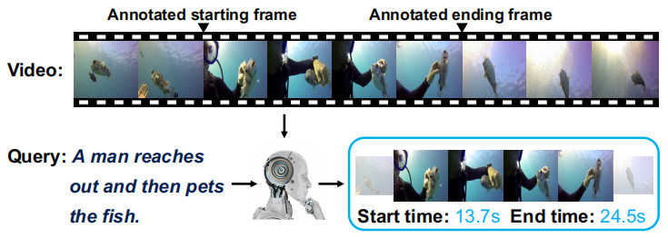
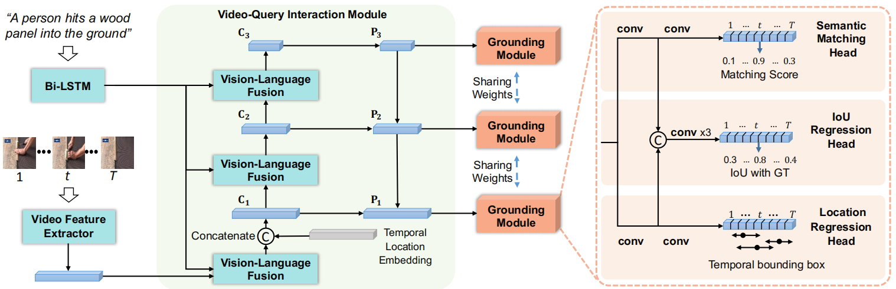
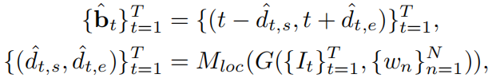
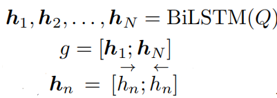
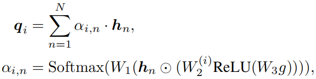
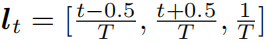
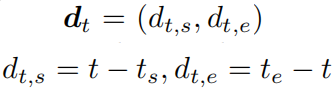
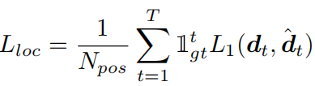
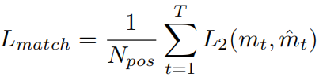
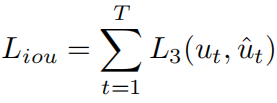

一、Dense Regression Network for Video Grounding, CVPR2020
----------------------------------------------------------

### 1、解决问题

如下图所示，Video Grounding任务的目的是在视频中定位对应于给定查询（一句描述）的目标视频段的起始和结束时间，该任务一个关键问题是视频通常可以包含数千帧，但它可能只有很少的帧被标注为起始和结束帧（即正训练示例），而之前的方法都忽略了来自被标注的起始结束位置之间的帧的丰富信息，往往直接使用这些不平衡的数据训练一个二分类模型。因此，作者训练了一个模型来预测每个帧到目标视频段边界的距离，并将目标视频段范围内的所有帧都作为正训练样本，这样训练样本大大增加，有利于训练。
<!-- more -->

### 2、方法

如上图所示，作者提出dense regression network (DRN)模型，首先使用视频-查询交互模块G提取多尺度的特征图，之后每个特征图都被定位模块（包括位置回归头、语义匹配头和IoU回归头）处理。其中，位置回归头预测每个帧到起始和结束位置的距离，然后得到对应的时间范围：

之后要在所有时间范围中选择和查询最匹配的。为此，作者使用语义匹配头从语义上预测每个时间范围内的内容和查询的匹配分数，以及使用IoU回归头预测一个分数来直接评估每个时间范围和真实标注的IoU，最后使用这两个分数的乘积表示每一帧预测出的时间范围的质量。

#### 1）多层次视频-查询交互模块

首先使用特征提取器（如C3D模型）提取视频帧的特征集合，然后通过多层次融合和时间位置嵌入产生视觉-语言表示。对于**多层次融合**：由于数据集中目标视频段往往有很大的尺度变化，比如Charades-STA数据集中最短的视频段是2.4s而最长的为180.8s，因此作者从多个层次获得一组层次特征图来解决这个问题，其中每个层次关注输入查询的不同部分。首先通过一个双向LSTM对查询中每个单词进行编码，并得到一个全局表示：

对于第i个层次，为每个单词计算一个注意力权重，并得到对应的查询特征：

其中W1和W3在不同层之间共享参数，W2是分离的。

对于一个视频，提取出的特征是一个T\*c的矩阵M，T表示帧数，c表示通道维度。因此，需要先将每个层次的查询特征q复制T次得到特征图D，然后使用元素乘法来融合M和D得到L个特征图C（论文中设置层次数L为3）。最后，使用FPN网络（用于目标检测的特征金字塔网络）得到特征图P。

对于**时间位置嵌入**：作者发现查询中通常包含一些关于时间顺序的单词，例如“after”和“before”，因此作者将视频的时间信息融合到视觉特征中。第t帧（或段）的时间位置为：

，将这个位置嵌入表示连接到视觉-查询融合模块输出的通道维度上，得到特征图C1。

#### 2）定位模块

**位置回归头**：对于P中每个位置t，如果落到目标视频段中，那么这个位置被认为是一个训练样本，其回归目标为一个二维向量，表示t到对应目标视频段起始结束位置的距离：

并且多层次特征提取进一步增强了训练样本数量。模型包括两个1维卷积层并且后一层输出2个通道。

**语义匹配头**：如果某帧落到目标视频段中，则它的语义匹配得分标注为1否则标注为0。模型包括两个1维卷积层并且后一层输出1个通道。

**IoU回归头**：使用一个3层卷积层实现，输入是从语义匹配头和位置回归头的第一个卷积层获得的特征图的连接。训练目标就是预测的时间范围和真实标注的IoU值。

#### 3）训练细节

位置回归头的损失函数为：

其中当位置t落到目标范围时指示函数取1，N_pos表示正样本数（也就是目标范围视频帧的数目），L1使用IoU回归损失。

语义回归头的损失函数为：

采用focal loss作为L2，因为它在处理类不平衡问题时是有效的。

IoU回归头的损失函数为：

使用Smooth-L1损失作为L3，因为它对异常值不那么敏感。

通过三步来训练模型：第一步去掉IoU回归头模块进行训练；第二步固定模型中其他参数，只训练IoU回归头；第三部优化整个模型。
