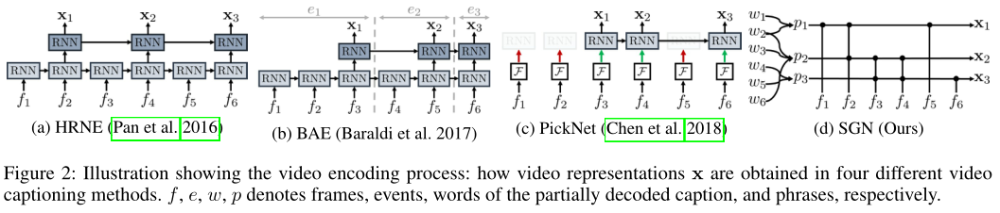
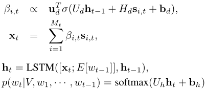

一、Semantic Grouping Network for Video Captioning, AAAI2021
------------------------------------------------------------
> [自制PPT](https://github.com/ezeli/notes_in_BIT/raw/master/PPT/AAAI2021%20Semantic%20Grouping%20Network%20for%20Video%20Captioning.pptx)

### 1、解决问题

<!-- more -->
连续的视频帧不是独立的，并不是只提供唯一的信息，而之前的方法通过合并（上图a、b）或者丢弃（c）连续帧来编码整个视频，并且在之后的解码过程中一直使用相同的视频特征。作者提出了Semantic Grouping Network (SGN)网络（d），在解码过程中可以动态的捕获已经生成的部分描述中的最具辨别性的短语，并将这些短语和相关的视频帧进行关联，组成语义组，从而对视频进行编码，因此在解码过程中视频编码是根据已生成描述来自适应/动态更新的，可以更好地利用上下文。并且作者提出了对比注意力损失来准确对齐短语和视频帧而无需监督信息。详细过程如下图所示：

我认为和Transformer相比，Transformer也会利用之前生成的描述对视频帧特征进行注意力融合，但是并不会显示地进行语义分组，更像是一种隐式的、暴力的利用、融合方式。

### 2、方法

#### 1）Visual Encoder

通过预训练的2D和3D网络对视频帧进行编码，并将两种特征连接起来作为最终的视频帧特征。

#### 2）Phrase Encoder

在识别相关视频帧时，短语比单词更合适。因为有些单词（比如“is”、“the”）单独来说并没有实际意义，并且有些单词并不足以定位视频帧，比如“戴眼镜的男人”比单独的“男人”或者“眼睛”更明确。

要从已生成的描述中构建短语，重要的是建模单词之间的依赖项以及看它们是如何相关的。Phrase Encoder采用注意力机制通过已生成t-1个单词W来构造t-1个短语表示P和注意力矩阵A：

#### 3）Semantic Grouping

Phrase Encoder生成候选短语数量和单词数（t-1）相同，而其中许多短语非常相似，所以需要使用Phrase Suppressor进行过滤，得到一组独特的短语，再使用Semantic Aligner将短语和视频帧进行对齐。

**Phrase Suppressor**：通过注意力矩阵A的外积来测量两个短语的相似性，如果外积大于阈值则认为两个短语是相似的，并将其中和其他所有短语更相似的短语丢弃，保留另一个短语：

**Semantic Aligner**：首先计算每个短语和每个视频帧特征的相关性得分（通过softmax对输入视频帧和负视频帧计算得到的正负相关性得分进行归一化），然后对视频帧特征进行融合，得到和短语对齐的视频特征，最后将短语特征和对齐的视频特征进行连接得到语义组：

#### 4）Decoder

对语义组信息进行注意力加权求和用于生成下一个单词：

#### 5）Training

除了交叉熵loss，还提出了对比注意力（CA）loss，用于短语和视频帧的准确对齐。首先采样一个负视频（其描述与输入视频除了“a”、“the”等停用词之外不包含相同单词），然后在计算相关性得分时，对正负相关性得分进行softmax归一化得到，最后提高正相关性得分，使模型学会更关注和短语相关的视频帧：

